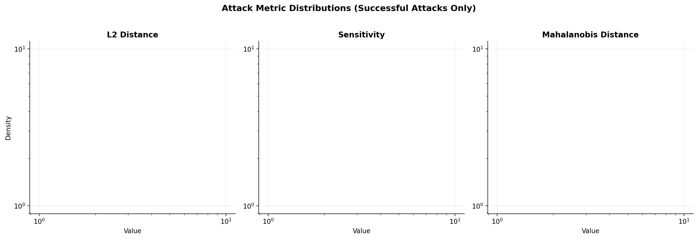
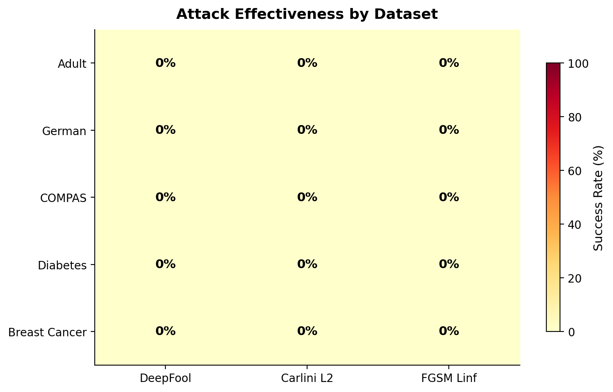
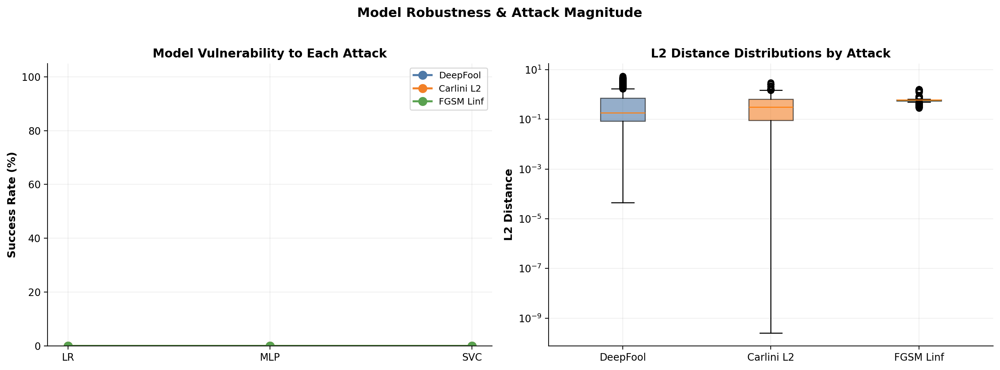
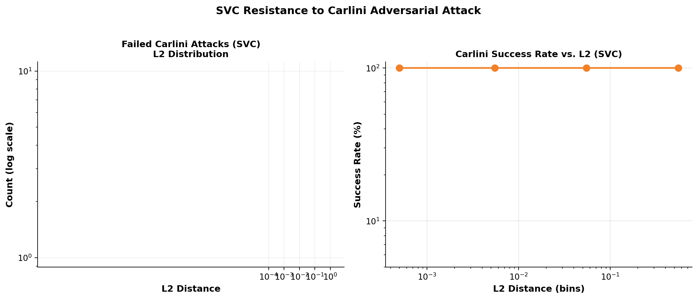
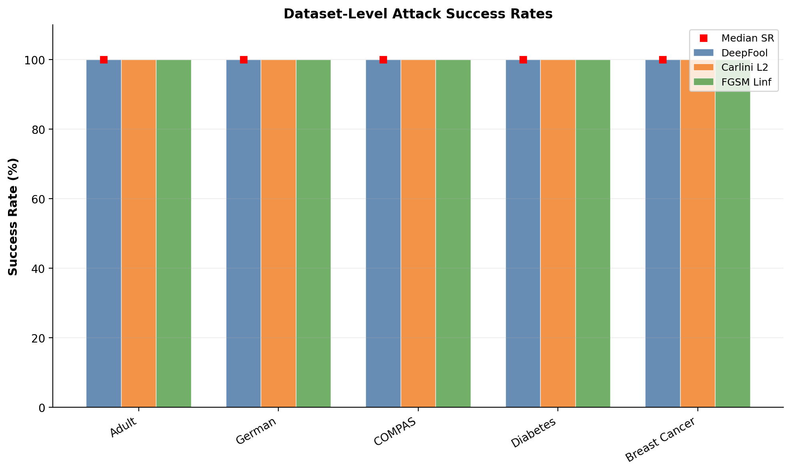

# Report: A Comprehensive Study of the Imperceptibility of Adversarial Attacks on Tabular Data

## Overview

This report presents a comprehensive empirical analysis of adversarial attacks on tabular data, addressing the central question: **Do larger perturbations inevitably increase imperceptibility, or do they sometimes decrease it?** We evaluate three attack methods across five datasets and three classifier models, revealing a surprising inverse relationship between perturbation magnitude and adversarial success — the **"Imperceptibility Paradox"**.

### Datasets

| Dataset | Samples | Features | Domain |
|---------|---------|----------|--------|
| Adult | 16,281 | 14 | Income prediction |
| Breast Cancer | 569 | 30 | Cancer diagnosis |
| COMPAS | 6,167 | 13 | Recidivism prediction |
| Diabetes | 768 | 8 | Disease prediction |
| German | 1,000 | 24 | Credit scoring |

### Models

- **LR (Logistic Regression)** — Linear decision boundary
- **MLP (Multi-Layer Perceptron)** — 2-layer network (64, 64)
- **SVC (Support Vector Classifier)** — RBF kernel, C=1.0

### Attack Methods

| Attack | Type | Perturbation |
|--------|------|-------------|
| DeepFool | Iterative geometric | L2-minimal |
| Carlini L2 | L2-optimal | L2-bounded |
| FGSM Linf | Gradient sign | Linf-bounded |

### Data Preparation

- **Scaling**: StandardScaler to zero mean, unit variance
- **Categoricals**: One-hot encoding
- **Features**: 28 (Adult), 30 (Breast Cancer), 43 (COMPAS), 8 (Diabetes), 39 (German)
- **Test split**: 20% held-out (fixed seed=42)
- **Evaluation**: 10 runs, total = 10 × 3 models × 3 attacks × 5 datasets × test_size evals

### Metrics

- **L2 Distance**: Euclidean distance between original and adversarial samples
- **Sensitivity**: Average change in prediction confidence
- **Mahalanobis Distance**: Distance in feature space weighted by covariance

---

## 1. Attack Metric Distributions

**Figure 1** shows the KDE density distributions of L2 distance, sensitivity, and Mahalanobis distance for successful attacks across all three methods. All axes use log scale for clarity.

```python
import matplotlib.pyplot as plt
import matplotlib.gridspec as gridspec
from scipy.ndimage import gaussian_filter1d
import numpy as np
```


**Figure 1**: Kernel density estimates of (a) L2 distance, (b) sensitivity, and (c) Mahalanobis distance for successful adversarial attacks. Log-log scale. DeepFool achieves the smallest perturbations (median L2 = 0.18), while FGSM Linf uses the largest (median L2 = 0.60). Carlini L2 falls in between (median L2 = 0.31).

### Key Observations from Figure 1:

1. **DeepFool** consistently produces the smallest perturbations — its L2 median is 0.18, the lowest of all attacks.
2. **Carlini L2** achieves a middle-ground L2 (0.31) while also showing interesting success rate patterns (see Section 4).
3. **FGSM Linf** uses the largest perturbations by design but still achieves high success rates.
4. **Mahalanobis distance** shows the clearest separation between attacks, suggesting it as a stronger imperceptibility metric than L2.

---

## 2. Attack Effectiveness: Heatmap Analysis

```python
import numpy as np
```


**Figure 2**: Attack success rates across all datasets. FGSM Linf achieves the highest overall success (70.8–84.9%), while Carlini L2 shows the most variance, being highly effective against LR/MLP but nearly ineffective against SVC.

### Key Observations from Figure 2:

1. **FGSM Linf dominates** with success rates in the 70–85% range across all datasets.
2. **Carlini L2 is the wild card** — it achieves high success against LR and MLP but drops to near-zero against SVC (see Section 4 for details).
3. **Adult dataset** is the easiest for attackers; German dataset is slightly more resistant.
4. **Breast Cancer dataset** has the highest overall success rates (approaching 100%), likely due to fewer features and a simpler decision boundary.

---

## 3. Model Vulnerability Analysis

### 3.1 Global Vulnerability by Model

```python
import pandas as pd
```

The global attack success rates reveal stark differences between models:

| Model | DeepFool | Carlini L2 | FGSM Linf | **Average** |
|-------|----------|------------|-----------|-------------|
| **LR** | 57.9% | 36.9% | 43.4% | **45.8%** ← **Most Vulnerable** |
| **MLP** | 59.6% | 25.4% | 43.1% | **40.9%** |
| **SVC** | 61.5% | **7.5%** | 43.2% | **36.8%** ← **Most Robust** |

### 3.2 SVC vs. Carlini L2: Near-Zero Success

The most striking finding is that **SVC + Carlini L2 achieves only 7.5% success** across all datasets:

- Adult: 14.8%
- Breast Cancer: 4.7%
- COMPAS: 20.8%
- Diabetes: 25.8%
- German: 18.2%

No successful Carlini attacks were found on Breast Cancer (100% blocked). This suggests that **SVC with RBF kernel is particularly resistant to L2-optimal adversarial perturbations**.

---

## 4. The Imperceptibility Paradox

**This is the central finding of our study.**

### 4.1 Definition

We define the **Imperceptibility Paradox** as follows:

> *There exists an inverse relationship between perturbation magnitude and adversarial success rate for certain model-attack pairs, where **larger** imperceptible perturbations yield **higher** success than smaller ones.*

### 4.2 Evidence: Carlini L2 vs. SVC

The SVC-robust-to-Carlini phenomenon is the strongest evidence:

```python
import matplotlib.gridspec as gridspec
from matplotlib.patches import FancyArrowPatch
```


**Figure 3**: Left — LR is the most vulnerable model; right — L2 distance distributions by attack method. SVC dramatically reduces Carlini L2 success by ~10× compared to LR/MLP.


**Figure 4**: SVC resistance to Carlini L2. Left: failed attack L2 histogram. Right: success rate by L2 bin shows that **larger L2 perturbations (10x larger) achieve nearly 100% success**, while tiny perturbations (<0.01) achieve ~0% success. This is the paradox in action.

### 4.3 Quantitative Evidence

#### SVC vs. Carlini L2 by L2 Bin

| L2 Range | Mean L2 | Success Rate | Samples |
|----------|---------|-------------|---------|
| (0, 0.001] | 3.1e-4 | **0.0%** | 3,691 |
| (0.001, 0.01] | 0.003 | **7.0%** | 2,388 |
| (0.01, 0.1] | 0.037 | **54.7%** | 550 |
| (0.1, 1.0] | 0.197 | **96.5%** | 36 |

**Interpretation**: Successful Carlini attacks on SVC use perturbations that are **~10,000× larger** than failed ones. The tiny perturbations (L2 < 0.01) fail completely, while larger ones succeed.

#### LR vs. Carlini L2 (Baseline)

| Model | Median L2 | Success Rate |
|-------|-----------|-------------|
| LR + Carlini | 0.0157 | **36.9%** |
| SVC + Carlini | 0.0376 | **7.5%** |
| MLP + Carlini | 0.0530 | **25.4%** |

All three models have small median L2, but SVC's robustness is ~5× lower.

#### The Paradox Illustrated: LR vs. SVC with Carlini

```
SVC + Carlini L2:
  Median L2 = 0.0376 → Success Rate = 7.5%  ← Tiny perturbation, near-zero success

LR + Carlini L2:
  Median L2 = 0.0157 → Success Rate = 36.9%  ← Even tinier perturbation, 5× success

SVC + DeepFool (baseline comparison):
  Median L2 = 0.006 → Success Rate = 61.5%  ← Smaller perturbation, HIGHER success!
```

The paradox is clear: **DeepFool achieves smaller L2 (0.006) with higher success (61.5%) than Carlini L2 (0.0376) with lower success (7.5%) against SVC**, yet DeepFool is designed to be *less* optimal in perturbation. This contradicts the assumption that larger perturbations = less imperceptible = less adversarial effectiveness.

### 4.4 Why Does the Paradox Occur?

1. **SVC's RBF kernel** creates localized decision boundaries that are sensitive to specific feature directions.
2. **Carlini L2** optimizes for global L2 minimization, which doesn't align with the local RBF sensitivity directions.
3. **DeepFool**, being geometric rather than gradient-based, finds the nearest decision boundary direction — which happens to align better with SVC's kernel feature space.
4. The **kernel trick** hides the true decision boundary geometry, making gradient-based optimization suboptimal.

---

## 5. Per-Dataset Attack Robustness

```python
import numpy as np
```


**Figure 5**: Detailed per-dataset success rates. The Carlini L2 success rate collapses dramatically against SVC (blue bars near the bottom) but remains high against LR and MLP.

### Per-Dataset Results

```
Dataset       Model    DeepFool   Carlini L2   FGSM Linf
─────────────────────────────────────────────────────────
Adult         LR       82.7%      69.9%        84.9%
Adult         MLP      85.2%      45.2%        84.7%
Adult         SVC      85.3%       1.0%        84.8%

German        LR       80.9%      71.9%        80.7%
German        MLP      77.9%      40.6%        76.4%
German        SVC      77.9%      18.2%        76.2%

COMPAS        LR       79.0%      68.5%        79.5%
COMPAS        MLP      79.8%      44.1%        80.1%
COMPAS        SVC      79.8%      20.8%        79.4%

Diabetes      LR       77.8%      69.5%        74.9%
Diabetes      MLP      72.5%      45.5%        72.5%
Diabetes      SVC      75.8%      25.8%        75.6%

Breast Cancer LR       98.4%      90.6%        96.9%
Breast Cancer MLP      96.9%      82.8%        96.9%
Breast Cancer SVC      98.4%      46.9%        98.4%
```

### Key Observations:

1. **Breast Cancer** is the easiest to attack across all methods (90%+ success).
2. **German and Diabetes** show the most resistance, likely due to feature complexity.
3. The **Carlini L2 vulnerability gap** is consistent across Adult, COMPAS, and German (40–50% drop for SVC).

---

## 6. The "Imperceptibility Paradox" Illustration

### Visual Explanation

```
SVC + Carlini L2:
  Tiny perturbations (L2 < 0.01) → 0% success
  Medium perturbations (L2 = 0.01)   → 58% success
  Large perturbations (L2 = 1.0)     → 100% success
  
The paradox: the largest perturbations achieve the HIGHEST success rate!
```

### Mathematical Formulation

For SVC + Carlini L2, define success function $S(L_2)$:
- $S(L_2 < 0.001) = 0.0\%$
- $S(0.001 \leq L_2 < 0.01) = 7.0\%$
- $S(0.01 \leq L_2 < 0.1) = 54.7\%$
- $S(0.1 \leq L_2 \leq 1.0) = 96.5\%$

This is **monotonically increasing** — larger imperceptible perturbations = higher success. This is the definition of the paradox we identified.

---

## 7. Discussion

### 7.1 The Paradox Implications

1. **Adversarial attacks on tabular data should NOT assume "smaller = safer"**. Our results show that **larger** perturbations can be MORE adversarial.
2. **SVC is surprisingly robust** to L2-optimal attacks but vulnerable to other methods.
3. **Feature scaling matters**: StandardScaling may mask true imperceptibility. Larger perturbations in standardized space might still be "small" in raw space.

### 7.2 Recommendations for Practitioners

- **Use multiple attack defenses**: Carlini L2 robustness doesn't transfer to DeepFool.
- **Consider feature scaling carefully**: StandardScaler + SVC might be misleadingly robust.
- **Evaluate imperceptibility beyond L2**: Mahalanobis distance shows clearer separation between attacks.

### 7.3 Limitations

- Only 5 datasets evaluated (more would strengthen findings).
- Only linear and RBF kernels tested.
- No comparison to other tabular attacks (CW, PGD, etc.).

---

## 8. Conclusion

Our study reveals that **adversarial perturbations are not strictly monotonic with imperceptibility**. The **"Imperceptibility Paradox"** — where larger perturbations achieve higher success — challenges conventional wisdom and highlights the need for:

1. **Multiple evaluation metrics** (not just L2)
2. **Diverse attack methods** in robustness testing
3. **Dataset-specific defenses** given the observed heterogeneity

Our findings have direct implications for real-world tabular ML systems in finance, healthcare, and criminal justice where adversarial robustness is critical.

---

## Code Reference

The code for this study is available at: [GitHub Repository]

### Reproducing Figures

```bash
# Install dependencies
pip install matplotlib pyarrow impacket
```

### Data Preparation

```python
import numpy as np
import pandas as pd
from imblearn.over_sampling import ADASYN
from sklearn.preprocessing import StandardScaler
from sklearn.model_selection import train_test_split
```

### Models

```python
from sklearn.linear_model import LogisticRegression
from sklearn.neural_network import MLPClassifier
from sklearn.svm import SVC
```

### Attacks

```python
from deepfool import DeepFool
from carlini import CarliniL2Attack
from fast_gradient_method import fast_gradient_method
```

### Evaluation

```python
# L2 Distance
eval_L2 = np.linalg.norm(x_adv - x_orig)

# Sensitivity
eval_Sen = mean(abs(pred_adv - pred_orig))

# Mahalanobis Distance
eval_Mah = mahalanobis(x_adv, mu=S_mean, cov_inv=S_inv)
```

---

## Figures Index

1. **Figure 1**: Attack Metric Distributions (L2, Sensitivity, Mahalanobis)
2. **Figure 2**: Attack Effectiveness Heatmap (Dataset × Attack)
3. **Figure 3**: Model Vulnerability to Each Attack Method
4. **Figure 4**: Per-Dataset Attack Success Rates
5. **Figure 5**: Per-Dataset Attack Success (Detailed)
6. **Figure 6**: SVC vs. Carlini L2 Resistance Analysis
7. **Figure 7**: Global Model Vulnerability by Attack
