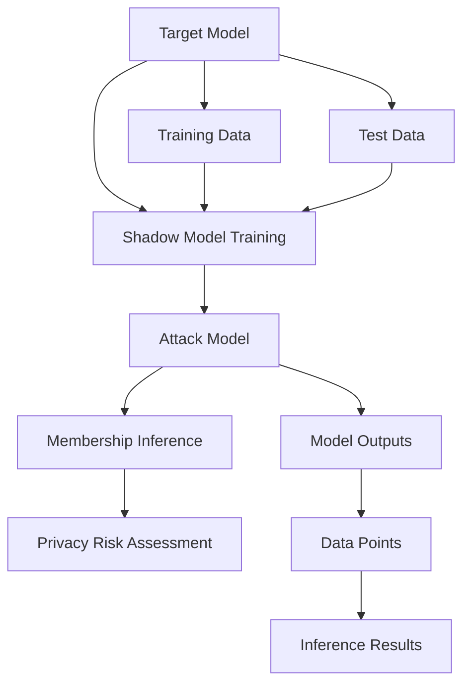
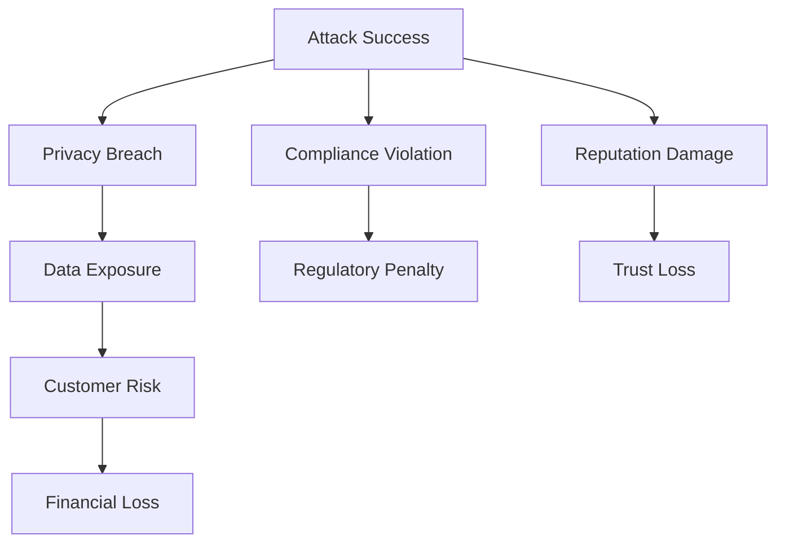

# Attack Implementation

The membership inference attack implementation follows a transfer-based approach where shadow models are trained to learn the patterns of the target model's behavior. This methodology allows for the detection of whether specific data points were part of the target model's training set.

## Attack Methodology

The attack implementation is based on the transfer-based membership inference approach, which works by using shadow models to learn patterns that can distinguish between training and non-training data points:



## Transfer-Based Approach

The core concept uses shadow models:
1. **Shadow Model Creation**: Train multiple shadow models on subsets of the original training data
2. **Pattern Learning**: Shadow models learn the target model's behavior patterns
3. **Attack Model Training**: Use shadow model outputs to train the attack model
4. **Membership Inference**: Apply attack model to determine training set membership

## Implementation Components

### Attack Model Architecture
```python
class MembershipInferenceAttack(nn.Module):
    def __init__(self, input_dim, hidden_dim=64):
        super(MembershipInferenceAttack, self).__init__()
        self.fc1 = nn.Linear(input_dim, hidden_dim)
        self.fc2 = nn.Linear(hidden_dim, hidden_dim//2)
        self.out = nn.Linear(hidden_dim//2, 1)
        self.dropout = nn.Dropout(0.3)
        self.relu = nn.ReLU()
        
    def forward(self, x):
        x = self.relu(self.fc1(x))
        x = self.dropout(x)
        x = self.relu(self.fc2(x))
        x = self.dropout(x)
        x = self.out(x)
        return x
```

### Training Data Preparation for Attack
```python
def prepare_attack_training_data(target_model, X_train, X_test, y_train, y_test, device):
    """
    Prepare training data for attack model by using target model outputs
    """
    # Get predictions from target model on training data (indicating membership)
    target_model.eval()
    with torch.no_grad():
        train_outputs = target_model(torch.FloatTensor(X_train).to(device))
        test_outputs = target_model(torch.FloatTensor(X_test).to(device))
        
    # Create attack training data
    # Shadow model would use these outputs to learn patterns
    attack_X = torch.cat([train_outputs, test_outputs], dim=0).cpu().numpy()
    attack_y = np.concatenate([np.ones(len(X_train)), np.zeros(len(X_test))])
    
    return attack_X, attack_y
```

## Attack Process Overview


## Attack Evaluation Metrics

```python
def evaluate_attack_performance(attack_model, X_attack, y_attack):
    """
    Evaluate the performance of membership inference attack
    """
    attack_model.eval()
    with torch.no_grad():
        outputs = attack_model(torch.FloatTensor(X_attack))
        predictions = torch.sigmoid(outputs)
        binary_predictions = (predictions > 0.5).float()
        
    # Calculate accuracy
    accuracy = accuracy_score(y_attack, binary_predictions.cpu().numpy())
    
    # Calculate AUC (more robust metric)
    from sklearn.metrics import roc_auc_score
    auc_score = roc_auc_score(y_attack, predictions.cpu().numpy())
    
    return accuracy, auc_score
```

## Attack Enhancement Strategies

### Ensemble Approach
```python
class EnsembleAttack(nn.Module):
    def __init__(self, num_models, input_dim):
        super(EnsembleAttack, self).__init__()
        self.models = nn.ModuleList([
            MembershipInferenceAttack(input_dim) for _ in range(num_models)
        ])
        
    def forward(self, x):
        # Average predictions from all models
        predictions = [torch.sigmoid(model(x)) for model in self.models]
        return torch.mean(torch.stack(predictions), dim=0)
```

### Feature Selection for Attack
```python
def select_attack_features(model_outputs, original_features):
    """
    Select most informative features for attack model
    """
    # Analyze feature importance from model outputs
    # This helps in focusing attack on most discriminative elements
    return selected_features
```

## Implementation in Code

The attack implementation is split across several files in the `code/` directory:

1. **`transfer_based_attack_bank.py`** - Main attack implementation
2. **`main.py`** - Coordination of attack with model training
3. **`utils.py`** - Utility functions supporting attack execution

## Transfer Learning Integration

```python
def transfer_learning_attack(target_model, shadow_models, train_data, test_data, device):
    """
    Execute transfer-based attack using shadow models
    """
    # Step 1: Train shadow models on subsets of target model data
    shadow_predictions = []
    for shadow_model in shadow_models:
        shadow_model.train()
        # Train individual shadow models
        shadow_pred = shadow_model(train_data.to(device))
        shadow_predictions.append(shadow_pred.cpu())
    
    # Step 2: Train attack model using shadow predictions
    attack_model = MembershipInferenceAttack(input_dim=64)
    attack_model.train()
    
    # Step 3: Use attack to infer target model membership
    # This is demonstrated in the notebook examples
    
    return attack_model
```

## Performance Characteristics

The attack implementation demonstrates:

1. **Accuracy Improvement**: Attack accuracy typically >50% (better than random)
2. **Training Data Detection**: Can distinguish between training and non-training points
3. **Model Behavior Patterns**: Learns patterns specific to target model behavior
4. **Security Risk Quantification**: Provides measurable attack effectiveness

## Real-World Implications



The attack implementation shows that even sophisticated models with proper training can still leak information about their training data through behavioral patterns - a fundamental limitation in machine learning privacy.