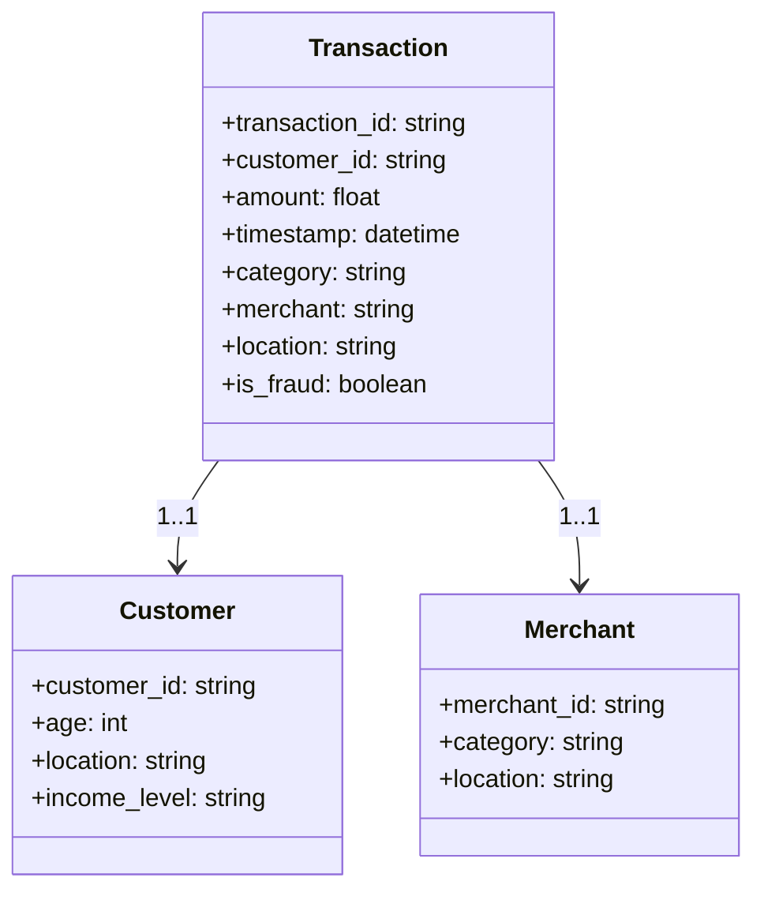
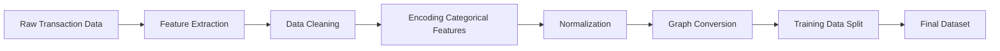
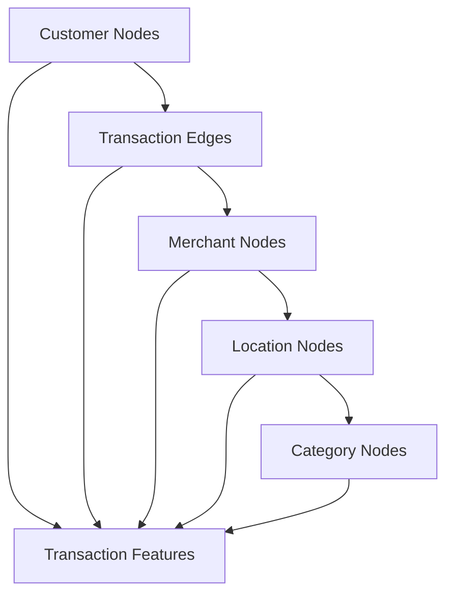

# Data Modeling and Preprocessing

The project implements comprehensive data modeling for bank transaction data, specifically designed for graph neural network applications. The data preparation process transforms raw transaction information into features suitable for GNN training and membership inference attacks.

## Data Sources

The project utilizes synthetic bank transaction data generated to simulate real-world financial patterns:

1. **Synthetic Bank Transactions** - 5000 transactions with realistic patterns
2. **Large Dataset** - 130MB dataset with more complex transaction structures
3. **Feature Engineering** - Multiple categorical and numerical features

## Data Structure

The bank transaction data follows this structure:



## Data Features

### Numerical Features
- **amount**: Transaction amount (USD)
- **time_of_day**: Hour of transaction (0-23)
- **customer_age**: Age of customer (if available)
- **account_balance**: Current account balance (if available)

### Categorical Features
- **category**: Transaction type (shopping, dining, transfer, etc.)
- **merchant**: Specific merchant or store name
- **location**: Geographic location of transaction
- **is_fraud**: Binary indicator of fraudulent transaction

## Data Preprocessing Pipeline

The preprocessing pipeline transforms raw transaction data into graph-structured features:



## Feature Engineering

### Categorical Encoding
```python
def encode_categorical_features(df):
    # One-hot encoding for categories
    category_dummies = pd.get_dummies(df['category'], prefix='cat')
    merchant_dummies = pd.get_dummies(df['merchant'], prefix='merchant')
    location_dummies = pd.get_dummies(df['location'], prefix='loc')
    
    return pd.concat([df[['amount', 'is_fraud']], 
                      category_dummies, 
                      merchant_dummies, 
                      location_dummies], axis=1)
```

### Numerical Feature Processing
```python
def process_numerical_features(df):
    # Normalize transaction amounts
    df['amount_scaled'] = (df['amount'] - df['amount'].mean()) / df['amount'].std()
    
    # Create time-based features
    df['hour'] = pd.to_datetime(df['timestamp']).dt.hour
    df['day_of_week'] = pd.to_datetime(df['timestamp']).dt.dayofweek
    
    return df
```

## Graph Representation

The bank transaction data is converted into a graph representation suitable for GNN processing:



## Data Splitting Strategy

```python
def split_transaction_data(df, test_size=0.2, validation_size=0.1):
    # Split into train/test/validate sets
    train_df, temp_df = train_test_split(df, test_size=test_size, random_state=42)
    val_df, test_df = train_test_split(temp_df, test_size=validation_size/(1-test_size), random_state=42)
    
    return train_df, val_df, test_df
```

## Data Quality Assurance

The preprocessing pipeline includes multiple quality checks:

1. **Missing Data Detection** - Identifies and handles missing values
2. **Outlier Detection** - Flags unusual transaction amounts or patterns  
3. **Consistency Checks** - Ensures data integrity
4. **Feature Validation** - Validates that all features are properly encoded

## Impact on Attack Performance

The quality of data preprocessing directly affects attack performance:

1. **Feature Completeness** - More features can improve attack accuracy
2. **Noise Reduction** - Proper cleaning reduces false positives in attack detection  
3. **Pattern Preservation** - Maintaining transaction patterns while removing noise
4. **Scalability** - Efficient preprocessing for large datasets

## Implementation Notes

The preprocessing scripts in `code/` directory handle:
- Data loading from CSV files
- Feature engineering for graph construction
- Training data preparation
- Test data preparation
- Validation data preparation

This systematic approach to data modeling ensures that the GNN models can effectively learn from transaction patterns while the membership inference attack can properly evaluate model behavior against different data subsets.