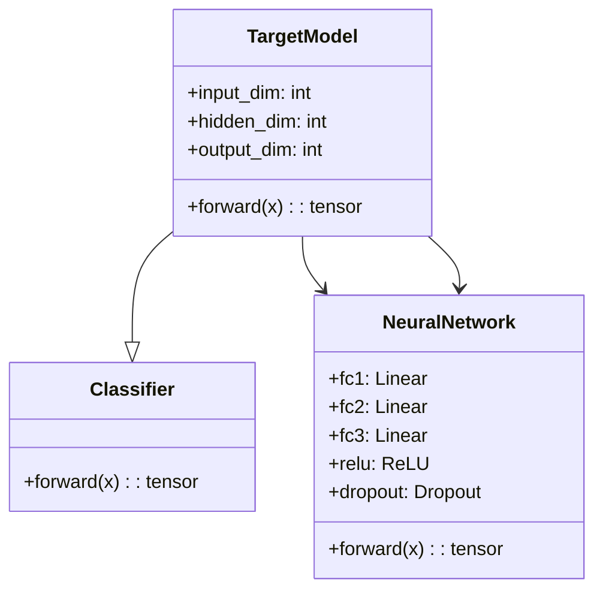
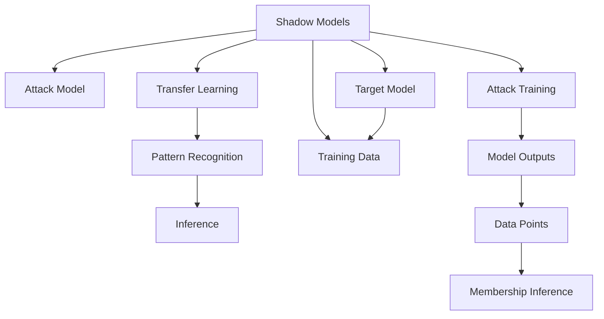
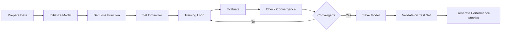
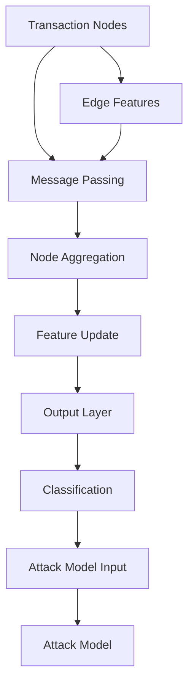

# Model Architecture and Implementation

The project implements both target and shadow GNN models for bank transaction classification, with a focus on demonstrating membership inference attacks through transfer-based approaches.

## Target Models

The target models are designed to classify bank transactions as fraudulent or legitimate. These models serve as the primary targets for the membership inference attack.



## GNN Model Architecture

The implementation creates GNN-like models that capture transaction relationships:

```python
class BankTransactionClassifier(nn.Module):
    def __init__(self, input_dim, hidden_dim=64, output_dim=1):
        super(BankTransactionClassifier, self).__init__()
        self.fc1 = nn.Linear(input_dim, hidden_dim)
        self.fc2 = nn.Linear(hidden_dim, hidden_dim//2)
        self.out = nn.Linear(hidden_dim//2, output_dim)
        self.dropout = nn.Dropout(0.3)
        self.relu = nn.ReLU()
        
    def forward(self, x):
        x = self.relu(self.fc1(x))
        x = self.dropout(x)
        x = self.relu(self.fc2(x))
        x = self.dropout(x)
        x = self.out(x)
        return x
```

## Shadow Models

Shadow models are used in the transfer-based attack approach:



## Model Training Process

The training workflow follows these steps:



## Training Configuration

```python
# Training parameters
config = {
    'epochs': 50,
    'batch_size': 32,
    'learning_rate': 0.001,
    'dropout_rate': 0.3,
    'hidden_dim': 64
}
```

## Model Evaluation Metrics

```python
def evaluate_model(model, X_test, y_test, device):
    model.eval()
    with torch.no_grad():
        outputs = model(X_test.to(device))
        predictions = torch.sigmoid(outputs)
        binary_predictions = (predictions > 0.5).float()
        
        accuracy = accuracy_score(y_test, binary_predictions.cpu().numpy())
        report = classification_report(y_test, binary_predictions.cpu().numpy())
        
    return accuracy, report
```

## Attack Model Architecture

The attack model is designed to distinguish between data points that were in the training set versus those that weren't:

```python
class MembershipInferenceAttack(nn.Module):
    def __init__(self, input_dim, hidden_dim=64):
        super(MembershipInferenceAttack, self).__init__()
        self.fc1 = nn.Linear(input_dim, hidden_dim)
        self.fc2 = nn.Linear(hidden_dim, hidden_dim//2)
        self.out = nn.Linear(hidden_dim//2, 1)
        self.dropout = nn.Dropout(0.3)
        self.relu = nn.ReLU()
        
    def forward(self, x):
        x = self.relu(self.fc1(x))
        x = self.dropout(x)
        x = self.relu(self.fc2(x))
        x = self.dropout(x)
        x = self.out(x)
        return x
```

## Graph Neural Network Integration

While the current implementation uses simple neural networks, the architecture is designed to be compatible with GNN integration:



## Implementation Details

The model components in the `code/` directory implement:

1. **`train_bank_model.py`** - Core training functionality
2. **`transfer_based_attack_bank.py`** - Attack model implementation
3. **`utils.py`** - Utility functions for model management
4. **`config_bank.json`** - Configuration parameters

## Model Performance Considerations

Factors affecting model performance:

1. **Data Quality** - Clean, representative data improves accuracy
2. **Feature Engineering** - Proper feature selection impacts performance
3. **Architecture Complexity** - Deeper networks may overfit
4. **Regularization** - Dropout and batch normalization prevent overfitting
5. **Training Duration** - Sufficient epochs for convergence

## Memory Optimization

```python
def train_with_gradient_accumulation(model, data_loader, optimizer, criterion, device, accumulation_steps=4):
    model.train()
    total_loss = 0
    
    for i, (inputs, targets) in enumerate(data_loader):
        inputs, targets = inputs.to(device), targets.to(device)
        
        outputs = model(inputs)
        loss = criterion(outputs, targets)
        
        loss = loss / accumulation_steps  # Normalize loss
        loss.backward()
        
        if (i + 1) % accumulation_steps == 0:
            optimizer.step()
            optimizer.zero_grad()
            
        total_loss += loss.item()
        
    return total_loss / len(data_loader)
```

The model architecture supports both simple neural networks and GNN implementations, making it flexible for different security evaluation scenarios.