# Membership Inference Attack against GNNs Project

This project implements a membership inference attack against Graph Neural Networks (GNNs) using bank transaction data. The implementation demonstrates how attackers can infer whether specific data points were part of a machine learning model's training dataset.

## Project Structure

```mermaid
graph TD
    A[Project Root] --> B[MIA_Bank_data]
    A --> C[code]
    A --> D[notebooks]
    A --> E[notes]
    
    B --> B1[bank_transaction_data.csv]
    B --> B2[synthetic_bank_transactions_5000.csv]
    B --> B3[bank_transaction_data_large.csv]
    
    C --> C1[synthetic_bank_dataset.py]
    C --> C2[synthetic_generator.py]
    C --> C3[transfer_based_attack_bank.py]
    C --> C4[main.py]
    C --> C5[train_bank_model.py]
    C --> C6[config_bank.json]
    C --> C7[utils.py]
    
    D --> D1[transfer_based_attack.ipynb]
    D --> D2[demo_bank_mia_attack.ipynb]
    D --> D3[demo_bank_mia_attack_simple.ipynb]
    D --> D4[demo_bank_mia_attack_fixed.ipynb]
    
    E --> E1[project_overview.md]
    E --> E2[data_modeling.md]
    E --> E3[model_architecture.md]
    E --> E4[attack_implementation.md]
    E --> E5[evaluation.md]
    E --> E6[security_implications.md]
```

## Key Components

The project consists of several interconnected modules that work together to implement the membership inference attack:

1. **Data Generation**: Synthetic bank transaction data creation
2. **Model Implementation**: GNN classifiers for transaction classification
3. **Attack Implementation**: Membership inference attack against target models
4. **Evaluation**: Performance metrics and visualization
5. **Documentation**: Comprehensive project documentation

## Folder Contents

### MIA_Bank_data Directory
Contains synthetic bank transaction datasets:
- `bank_transaction_data.csv` - Base dataset with 130MB of transaction data
- `synthetic_bank_transactions_5000.csv` - 5000 transactions for demonstration
- `bank_transaction_data_large.csv` - Large dataset with more complex patterns

### code Directory
House the core implementation files:
- `synthetic_bank_dataset.py` - Creates synthetic bank transaction datasets
- `synthetic_generator.py` - Generates synthetic financial data patterns
- `transfer_based_attack_bank.py` - Implements transfer-based attack approach
- `main.py` - Main entry point for project execution
- `train_bank_model.py` - Model training scripts
- `config_bank.json` - Configuration file for experiments
- `utils.py` - Utility functions for data processing and model evaluation

### notebooks Directory
Contains Jupyter notebooks for interactive demonstration:
- `transfer_based_attack.ipynb` - Full notebook with attack implementation
- `demo_bank_mia_attack.ipynb` - Comprehensive demonstration
- `demo_bank_mia_attack_simple.ipynb` - Simplified version that executes
- `demo_bank_mia_attack_fixed.ipynb` - Fixed version that executes

### notes Directory
Documentation of the project implementation:
- `project_overview.md` - Project description and goals
- `data_modeling.md` - Data preparation and feature engineering
- `model_architecture.md` - Model design and implementation
- `attack_implementation.md` - Attack methodology and approach
- `evaluation.md` - Evaluation metrics and results
- `security_implications.md` - Privacy implications and mitigations

## Project Goals

This implementation aims to demonstrate:

1. **Privacy vulnerabilities** in GNN models trained on sensitive data
2. **Membership inference attacks** that can reveal training set contents
3. **Security implications** of deploying machine learning models on financial data
4. **Mitigation strategies** for privacy-preserving machine learning

## Security Risk

The key demonstration shows that membership inference attacks can distinguish between data points that were part of the training set versus those that weren't, even with sophisticated GNN models. This demonstrates:

- **Data Exposure**: Sensitive information can be inferred from model behavior
- **Individual Privacy**: Customer transaction patterns can be potentially exposed
- **Model Vulnerability**: Even advanced models have privacy vulnerabilities