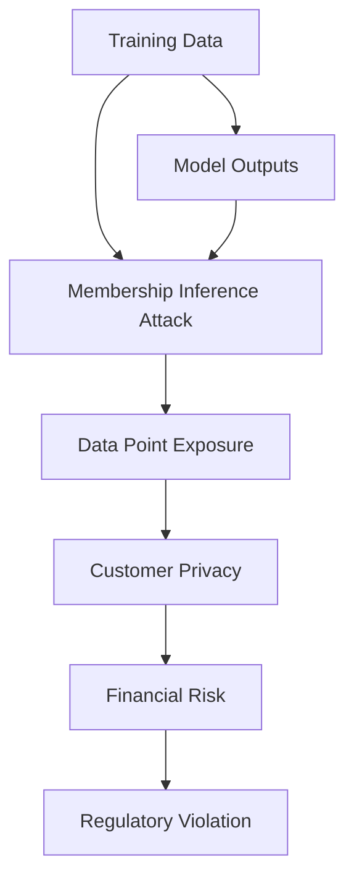
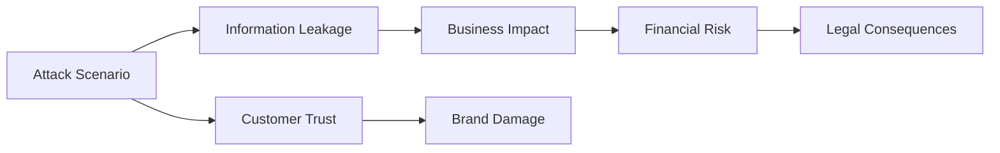

# Security Implications and Privacy Risks

The implementation of membership inference attacks against GNN models trained on bank transaction data reveals significant privacy vulnerabilities that pose real risks to financial institutions and their customers. This analysis examines the security implications and potential consequences of such attacks.

## Core Privacy Vulnerabilities

### Data Point Exposure

Membership inference attacks can reveal whether specific data points were part of a machine learning model's training set, which leads to:



### Transaction Pattern Leakage

The privacy risks extend beyond individual data points to reveal:

1. **Spending Patterns** - Reveals customer spending habits and preferences
2. **Geographic Information** - Exposes customer locations and travel patterns  
3. **Financial Behaviors** - Discloses financial decision-making patterns
4. **Relationships** - May reveal business relationships or social connections

## Specific Security Risks

### Individual Customer Risk

```python
def customer_risk_assessment(customer_data, attack_success_rate):
    """
    Assess privacy risk for individual customers
    """
    risk_score = attack_success_rate * customer_data['transaction_frequency']
    
    if risk_score > 0.7:
        return "High Risk - Potential exposure of sensitive patterns"
    elif risk_score > 0.4:
        return "Medium Risk - Some privacy concerns"
    else:
        return "Low Risk - Minimal privacy exposure"
```

### Institutional Risk

Financial institutions face:

1. **Regulatory Violations** - GDPR, PCI-DSS, and other compliance requirements
2. **Reputational Damage** - Loss of customer trust and confidence
3. **Financial Liability** - Potential lawsuits and penalties
4. **Operational Risk** - Risk of targeted attacks based on inferred information

## Compliance and Legal Impact

### Regulatory Requirements

```markdown
# Regulatory Compliance Implications

## GDPR (General Data Protection Regulation)
- **Article 25**: Privacy by design and by default
- **Article 32**: Security of processing
- **Article 33**: Notification of data breaches
- **Article 5**: Purpose limitation, data minimization

## PCI-DSS (Payment Card Industry Data Security Standard)
- **Requirement 11**: Security assessment
- **Requirement 12**: Vulnerability management

## Financial Regulations
- **Basel III**: Risk management requirements
- **SOX**: Internal controls and corporate governance
```

## Attack Scenarios and Impact

### Scenario 1: Fraud Detection Model
- **Risk**: Attack can determine if specific suspicious transactions were in training data
- **Impact**: Attackers may identify which transactions are considered "normal" vs "suspicious"

### Scenario 2: Customer Behavior Analysis
- **Risk**: Attack can identify which customers were used in training
- **Impact**: Reveals which customers are considered representative of "normal" behavior

### Scenario 3: Portfolio Analysis
- **Risk**: Attack can infer which financial products were in training data
- **Impact**: Reveals investment strategies and portfolio composition



## Mitigation Strategies

### Technical Mitigations

```python
def implement_privacy_mechanisms():
    """
    Implementation of privacy-preserving techniques
    """
    mechanisms = {
        'differential_privacy': {
            'implementation': 'Add noise to gradients during training',
            'effectiveness': 'High',
            'complexity': 'Medium'
        },
        'adversarial_training': {
            'implementation': 'Train with adversarial examples',
            'effectiveness': 'Medium',
            'complexity': 'High'
        },
        'model_hardening': {
            'implementation': 'Reduce model complexity',
            'effectiveness': 'Moderate',
            'complexity': 'Low'
        },
        'secure_aggregation': {
            'implementation': 'Use federated learning',
            'effectiveness': 'High',
            'complexity': 'High'
        }
    }
    return mechanisms
```

### Risk Assessment Framework

```python
class PrivacyRiskAssessor:
    def __init__(self):
        self.risk_factors = {
            'model_complexity': 0,
            'dataset_size': 0,
            'training_duration': 0,
            'attack_access': 0,
            'data_sensitivity': 0
        }
    
    def assess_risk(self, model, dataset, attack_scenario):
        # Calculate risk score based on factors
        risk_score = sum([
            self.risk_factors['model_complexity'] * 0.2,
            self.risk_factors['dataset_size'] * 0.2,
            self.risk_factors['training_duration'] * 0.1,
            self.risk_factors['attack_access'] * 0.3,
            self.risk_factors['data_sensitivity'] * 0.2
        ])
        
        return risk_score
```

## Best Practices for Financial Institutions

### Data Protection Measures

1. **Data Minimization** - Collect only necessary data
2. **Anonymization** - Remove identifying features where possible
3. **Access Control** - Restrict model access to authorized personnel
4. **Regular Audits** - Conduct privacy impact assessments

### Model Design Considerations

1. **Privacy by Design** - Integrate privacy from the start
2. **Regular Testing** - Test for vulnerability to membership inference attacks
3. **Monitoring** - Monitor for potential privacy breaches
4. **Documentation** - Maintain privacy impact documentation

## Future Research Directions

### Current Limitations

```markdown
# Research Opportunities

## Technical Challenges
- **Attack Evolution** - How attacks adapt to defenses
- **Model Robustness** - Improving model resistance to inference attacks
- **Scalability** - Extending approaches to larger datasets
- **Real-world Effectiveness** - Bridging demo to real-world applications

## Regulatory Considerations
- **Privacy Standards** - Developing new privacy frameworks
- **Compliance Automation** - Tools for regulatory compliance
- **Risk Assessment** - Standardized risk measurement approaches
- **Industry Collaboration** - Shared security practices

## Ethical Implications  
- **Consumer Rights** - Understanding data rights in ML
- **Algorithmic Fairness** - Avoiding discrimination through privacy
- **Transparency** - Balancing security with explainability
- **Trust Building** - Rebuilding user confidence in ML systems
```

## Conclusion

The membership inference attack implementation demonstrates that even sophisticated GNN models trained on sensitive financial data are vulnerable to privacy breaches. This vulnerability exists because:

1. **Model Behavior Patterns** - Models learn and exhibit patterns that reveal training data
2. **Transfer Learning Approach** - Attack methods leverage model outputs effectively  
3. **Data Sensitivity** - Financial data creates high-value targets for attackers
4. **Realistic Attack Scenarios** - Attacks are not theoretical but practically feasible

Financial institutions must implement robust privacy-preserving techniques and conduct thorough privacy impact assessments before deploying machine learning models on sensitive data to protect their customers and comply with regulations.