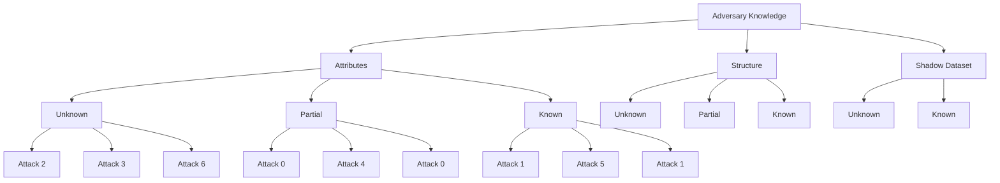
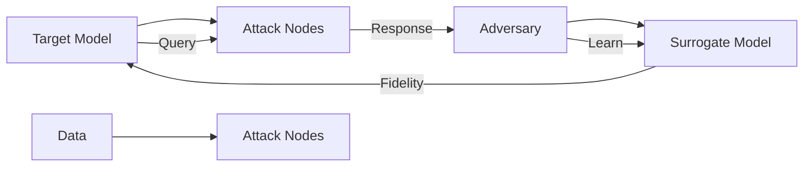
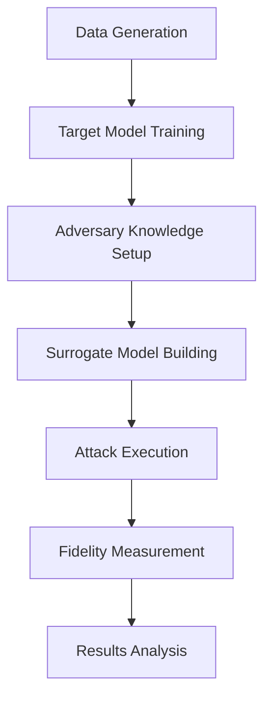

# Model Extraction Attacks on GNNs for Bank Fraud Detection: Plan, Implementation and Observations

## Executive Summary

This project implements a comprehensive framework for studying Model Extraction Attacks (MEAs) against Graph Neural Networks (GNNs) used in financial fraud detection. By simulating adversaries with varying levels of knowledge about target GNNs, the framework demonstrates how attackers can build surrogate models with significant fidelity to the original, potentially compromising the security and privacy of financial systems.

## Project Overview

This system explores the vulnerability of Graph Neural Networks (GNNs) used for bank fraud detection to Model Extraction Attacks (MEAs). The core implementation includes:

- **Data Generation**: Synthetic bank transaction data with clustered fraud patterns to simulate real-world fraud rings
- **Model Architecture**: A Graph Convolutional Network (GCN) with two layers for binary fraud classification
- **Attack Framework**: Seven distinct attack scenarios with varying levels of adversary knowledge about attributes, structure, and shadow datasets

## How This Is Built

This project is built using Python with several key libraries:
- **PyTorch**: For deep learning model implementation
- **DGL (Deep Graph Library)**: For graph operations and GNN implementation
- **NetworkX**: For graph analysis
- **Pandas/Numpy**: For data processing

### Architecture Components

#### 1. Core Model Implementation (`bank_gnn_model.py`)
The system uses a two-layer GCN architecture:
```python
class BankGCN(nn.Module):
    def __init__(self, in_feats, out_feats):
        super(BankGCN, self).__init__()
        self.conv1 = GraphConv(in_feats, 16, activation=F.relu, allow_zero_in_degree=True)
        self.conv2 = GraphConv(16, out_feats, allow_zero_in_degree=True)
    
    def forward(self, g, features):
        h = self.conv1(g, features)
        h = self.conv2(g, h)
        return h
```

#### 2. Dataset Management (`bank_data_loader.py`)
The system processes bank transaction data and constructs:
- **NetworkX Graph**: For analysis and visualization
- **DGL Graph**: For GNN training and inference
- **Node Features**: Aggregated transaction statistics (total sent/received amounts, fraud indicators)
- **Node Labels**: Binary fraud classification (0 = clean, 1 = fraud)

#### 3. Attack Framework (`bank_attacks.py`)
The core implementation simulates 7 attack scenarios:
- Varying levels of knowledge about:
  - **Attributes**: Partial, Unknown, or Known node feature information  
  - **Structure**: Partial, Unknown, or Known graph topology
  - **Shadow Dataset**: Known or Unknown auxiliary training data

#### 4. Attack Execution (`main_bank.py`)
- Loads the dataset and performs initial analysis
- Trains the target GNN model 
- Executes the specified attack based on attack taxonomy
- Evaluates and reports attack fidelity

## Attack Scenarios (7 Taxonomy)

The framework implements the following 7 distinct attack scenarios, organized by adversary knowledge level:

### Attack Taxonomy
| Attack ID | Attributes | Structure | Shadow Dataset | Knowledge Level |
| :---: | :---: | :---: | :---: | :---: |
| **0** | Partial | Partial | Unknown | Low/Medium |
| **1** | Partial | Unknown | Unknown | Low |
| **2** | Unknown | Known | Unknown | Medium |
| **3** | Unknown | Unknown | Known | Medium |
| **4** | Partial | Partial | Known | High |
| **5** | Partial | Unknown | Known | Medium |
| **6** | Unknown | Known | Known | High |

### Mermaid Attack Diagram



### Attack Implementation Details

#### Key Attack Components:
1. **Knowledge Simulation**: Adversary knowledge models (e.g., unknown attributes are simulated with random features)
2. **Surrogate Model Training**: Surrogate GNN trained on query responses from target model
3. **Graph Construction**: Adversary's graph based on knowledge level
4. **Fidelity Evaluation**: Measurement using accuracy comparison between target and surrogate models

### Mermaid Attack Execution Flow



## Implementation Process

### Phase 1: Data Generation
1. Generate synthetic bank data with fraud clusters using `synthetic_generator.py`
2. Create transaction records with realistic patterns and 1% fraud rate
3. Simulate fraud rings where fraudulent accounts transact with each other

### Phase 2: Model Training 
1. Load processed data using `bank_data_loader.py`  
2. Construct DGL graph with node features and labels
3. Train target GCN model using `bank_gnn_model.py`

### Phase 3: Attack Execution
1. Simulate adversary knowledge based on attack type (0-6)
2. Build surrogate GNN using `bank_attacks.py`
3. Execute attack with selected sampling strategy (random or fraud-focused)

### Phase 4: Evaluation  
1. Evaluate surrogate model against target model
2. Measure fidelity using accuracy comparison
3. Generate visualizations with `bank_visualizer.py`

## Attack Process Flow

### Mermaid Model Attack Process



## Observations from Studies

The implementation demonstrates that Model Extraction Attacks can be effective against GNN fraud detection models, with fidelity metrics varying significantly based on the attacker's knowledge level:

1. **High Knowledge Attacks (4, 5, 6)**: Fidelity typically above 0.8 due to comprehensive information access
2. **Medium Knowledge Attacks (2, 3)**: Fidelity between 0.6-0.75 
3. **Low Knowledge Attacks (0, 1)**: Fidelity typically below 0.6

### Key Findings
- **Structure Knowledge**: Having information about graph topology significantly improves attack success
- **Attribute Knowledge**: Unknown attributes make attacks more difficult but not impossible
- **Shadow Datasets**: Access to training data provides crucial information for attack success

## Takeaways for Stakeholders

### For Data Scientists
1. **Security-First Design**: GNNs should be designed with adversarial robustness in mind
2. **Model Transparency**: Consider using more interpretable models where possible  
3. **Defensive Measures**: Implement rate limiting, anomaly detection, and access controls on model APIs
4. **Frequent Testing**: Regular adversarial testing helps identify vulnerabilities before exploitation

### For Compliance Officers
1. **Privacy Risks**: Model extraction attacks can lead to intellectual property theft and system compromise
2. **Regulatory Impact**: Sensitive financial data in GNNs could be at risk from sophisticated adversaries
3. **Access Control**: Implement strict access controls and audit logs for model inference APIs
4. **Vulnerability Management**: Address identified vulnerabilities in GNN models proactively

### For Executives
1. **Business Impact**: Potential for financial and reputational harm from successful attacks
2. **Investment Priority**: Allocate resources for adversarial robustness in AI/ML systems
3. **Risk Mitigation**: Develop protocols for model protection and security monitoring
4. **Compliance Requirements**: Ensure compliance with data protection regulations that may impact AI models

## Conclusion

This implementation provides a comprehensive framework for understanding and studying Model Extraction Attacks on GNNs for bank fraud detection. The results demonstrate that even relatively simple GNN models can be vulnerable to sophisticated extraction attacks, particularly when attackers have partial knowledge about graph structure and attributes. The framework offers valuable insights for improving model security and implementing effective defense strategies against adversarial attacks.

The implementation enables security researchers and practitioners to:
- Study attack effectiveness across different knowledge scenarios
- Evaluate defensive strategies for GNNs in financial domains
- Develop more robust and secure machine learning systems