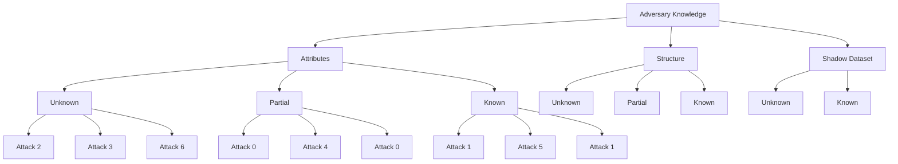

# Attack Taxonomy

## Overview
The attack taxonomy defines 7 distinct attack scenarios based on the adversary's knowledge level of node attributes, graph structure, and shadow datasets. This systematic approach allows for comprehensive evaluation of GNN security vulnerabilities under different threat models.

## Taxonomy Structure



## Attack Type Details

### Attack 0: Partial Attributes, Partial Structure, Unknown Shadow
- **Attributes**: Partial knowledge (some features available)
- **Structure**: Partial knowledge (some edges known)  
- **Shadow Dataset**: Unknown (no auxiliary data)
- **Knowledge Level**: Low/Medium
- **Description**: Adversary has limited information about both node features and graph structure but no auxiliary training data

### Attack 1: Partial Attributes, Unknown Structure, Unknown Shadow  
- **Attributes**: Partial knowledge (some features available)
- **Structure**: Unknown knowledge (no structural information)
- **Shadow Dataset**: Unknown (no auxiliary data)
- **Knowledge Level**: Low
- **Description**: Adversary knows some node attributes but nothing about graph topology, with no auxiliary data  

### Attack 2: Unknown Attributes, Known Structure, Unknown Shadow
- **Attributes**: Unknown knowledge (no feature information)
- **Structure**: Known knowledge (full graph structure available)
- **Shadow Dataset**: Unknown (no auxiliary data)
- **Knowledge Level**: Medium
- **Description**: Adversary knows full network structure but nothing about node features, with no auxiliary data

### Attack 3: Unknown Attributes, Unknown Structure, Known Shadow
- **Attributes**: Unknown knowledge (no feature information)
- **Structure**: Unknown knowledge (no structural information)
- **Shadow Dataset**: Known (has auxiliary training data)
- **Knowledge Level**: Medium
- **Description**: Adversary has no node feature or structural knowledge but has access to auxiliary training data

### Attack 4: Partial Attributes, Partial Structure, Known Shadow
- **Attributes**: Partial knowledge (some features available)
- **Structure**: Partial knowledge (some edges known)
- **Shadow Dataset**: Known (has auxiliary training data)
- **Knowledge Level**: High
- **Description**: Adversary has partial information about both features and structure with access to auxiliary data

### Attack 5: Partial Attributes, Unknown Structure, Known Shadow
- **Attributes**: Partial knowledge (some features available)
- **Structure**: Unknown knowledge (no structural information)
- **Shadow Dataset**: Known (has auxiliary training data)
- **Knowledge Level**: Medium
- **Description**: Adversary knows some node features and has auxiliary data but nothing about graph topology

### Attack 6: Unknown Attributes, Known Structure, Known Shadow
- **Attributes**: Unknown knowledge (no feature information)
- **Structure**: Known knowledge (full graph structure available)
- **Shadow Dataset**: Known (has auxiliary training data)
- **Knowledge Level**: High
- **Description**: Adversary has full structural knowledge and auxiliary data but no node feature information

## Knowledge Level Mapping

### Attribute Knowledge
| Attack Type | Knowledge Level | Description |
|-------------|----------------|-------------|
| 0, 1, 4, 5 | Partial | Some node feature information available |
| 2, 3, 6 | Unknown | No node feature information available |
| 1, 2, 3, 4, 5, 6 | Known | Full node feature information available |

### Structure Knowledge
| Attack Type | Knowledge Level | Description |
|-------------|----------------|-------------|
| 2, 6 | Known | Full graph structure available |
| 0, 4 | Partial | Some graph edges available |
| 1, 3, 5 | Unknown | No structural information available |

### Shadow Dataset Knowledge
| Attack Type | Knowledge Level | Description |
|-------------|----------------|-------------|
| 3, 4, 5, 6 | Known | Has access to auxiliary training data |
| 0, 1, 2 | Unknown | No auxiliary data available |

## Attack Complexity Analysis

### Low Knowledge Attacks (1, 2)
- **Complexity**: Moderate to high
- **Challenges**: Limited information makes accurate reconstruction difficult
- **Success Factors**: May require larger node sampling ratios
- **Security Implication**: Even basic attacks pose significant risk

### Medium Knowledge Attacks (0, 3, 5)  
- **Complexity**: Moderate
- **Challenges**: Partial information provides some guidance but still requires significant inference
- **Success Factors**: Moderate node sampling and query efficiency
- **Security Implication**: These attacks demonstrate substantial vulnerability

### High Knowledge Attacks (4, 6)
- **Complexity**: Low to moderate
- **Challenges**: Full information provides strong foundation for model reconstruction
- **Success Factors**: High fidelity expected with relatively small sampling
- **Security Implication**: These represent the most dangerous attack scenarios

## Attack Evolution and Implications

### Security Progression
1. **Unknown Knowledge Attacks**: Basic attacks with minimal information
2. **Partial Knowledge Attacks**: Sophisticated attacks with some information
3. **Complete Knowledge Attacks**: Advanced attacks with maximum information

### Attack Scenarios by Difficulty
```
Attack Type | Knowledge Level | Fidelity Expectation | Risk Level
------------|----------------|----------------------|------------
1           | Low            | Low                  | Medium
3           | Medium         | Medium               | High  
5           | Medium         | Medium               | High
0           | Low/Medium     | Medium               | High
2           | Medium         | Medium               | Medium
4           | High           | High                 | Very High
6           | High           | High                 | Very High
```

## Research Value

The attack taxonomy offers valuable insights for:
1. **Security Evaluation**: Systematic assessment of model vulnerability
2. **Defense Development**: Identifying weak points in GNN implementations  
3. **Attack Modeling**: Realistic threat modeling for financial systems
4. **Security Testing**: Comprehensive adversarial evaluation framework

## Implementation Guidance

### For Security Researchers
- Test attacks across all 7 scenarios to understand vulnerability surface
- Compare attack success rates based on knowledge levels
- Evaluate effectiveness of defensive mechanisms

### For Model Developers
- Implement defense strategies against partial knowledge attacks (0, 1, 3, 5)
- Design robust models that resist complete knowledge attacks (4, 6)
- Consider privacy-preserving model architectures

### For Compliance Officers
- Understand risk levels for different attack scenarios
- Evaluate regulatory compliance with different security approaches
- Plan security measures based on attack taxonomy risks