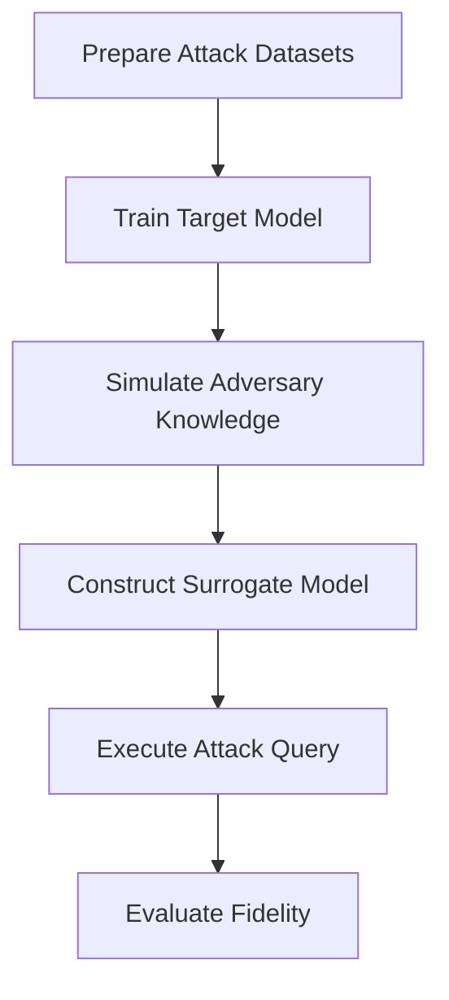
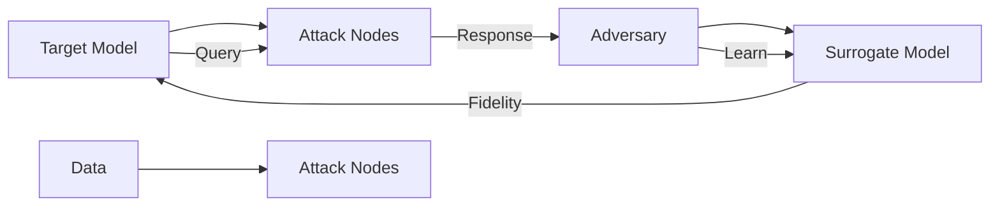

# Bank Attacks Framework

## Overview
The `bank_attacks.py` implements the core attack framework that simulates adversaries with different levels of knowledge about the target GNN model to extract its behavior.

## Attack Architecture



## Core Functions

### Main Attack Function: `run_attack()`
```python
def run_attack(attack_type, data_csv, attack_node_ratio=0.25, sampling_strategy="random"):
```

### Attack Type Mapping
The framework implements 7 distinct attack scenarios:
| Attack ID | Attributes | Structure | Shadow Dataset | Knowledge Level |
| :---: | :---: | :---: | :---: | :---: |
| **0** | Partial | Partial | Unknown | Low/Medium |
| **1** | Partial | Unknown | Unknown | Low |
| **2** | Unknown | Known | Unknown | Medium |
| **3** | Unknown | Unknown | Known | Medium |
| **4** | Partial | Partial | Known | High |
| **5** | Partial | Unknown | Known | Medium |
| **6** | Unknown | Known | Known | High |

## Knowledge Simulation

### Attribute Knowledge Levels
- **Unknown Attributes**: Features are randomly generated using `th.randn_like(features)`
- **Partial Attributes**: Features are averaged from sampled attack nodes
- **Known Attributes**: Full node features are available

### Structure Knowledge Levels  
- **Unknown Structure**: Minimal graph with no edges (empty graph)
- **Partial Structure**: Graph with ~50% of original edges randomly selected
- **Known Structure**: Full graph structure is available

### Shadow Dataset Knowledge
- **Unknown Shadow**: No auxiliary training data available
- **Known Shadow**: Shadow dataset with 10k transactions is generated and used for pre-training

## Attack Implementation Details

### Step-by-Step Process
1. **Dataset Preparation**: 
   - Loads and processes data using `prepare_attack_datasets()`
   - Identifies knowledge levels based on attack type

2. **Target Model Training**:
   - Trains original model using `train_target_model()`

3. **Adversary Knowledge Simulation**:
   - Samples nodes based on sampling strategy (random or fraud-focused)
   - Constructs adversary's knowledge graph based on knowledge levels

4. **Surrogate Model Construction**:
   - Initializes surrogate GNN with same architecture as target
   - Pre-trains on shadow dataset if available
   - Trains on queries to target model 

5. **Query and Training Process**:
   - Queries target model for labels of attack nodes
   - Uses these labels to train surrogate model
   - Employs both shadow dataset pre-training and query-based fine-tuning

## Surrogate Model Training

### Pre-training with Shadow Data
When shadow dataset is known:
- Queries target model for shadow dataset labels
- Pre-trains surrogate model on this data for 50 epochs
- Builds foundation using auxiliary training information

### Fine-tuning with Attack Queries
- Queries target model for labels of attack nodes
- Fine-tunes surrogate on these query results for 100 epochs
- Uses surrogate training mask to limit training to attack nodes

## Fidelity Measurement

### Evaluation Process
```python
fidelity = evaluate_model(surrogate_model, dgl_g, features, labels, test_mask)
```

### Fidelity Definition
Fidelity measures how closely surrogate model predictions match target model predictions on the test set:
- Higher fidelity = better extraction success
- Used to evaluate attack effectiveness across all 7 attack scenarios

## Attack Execution Flow

### Mermaid Attack Flow Diagram


## Adversary Knowledge Modeling

### Knowledge Level Determination
```python
knowledge = {
    "attr": "unknown" if attack_type in [2, 3, 6] else ("partial" if attack_type in [0, 1, 4, 5] else "known"),
    "struct": "known" if attack_type in [2, 6] else ("partial" if attack_type in [0, 4] else "unknown"),
    "shadow": "known" if attack_type in [3, 4, 5, 6] else "unknown",
}
```

### Attack-Specific Logic
Each attack type defines:
- What information the adversary knows about node attributes
- What information the adversary knows about graph structure  
- What information the adversary has about shadow datasets

## Key Technical Considerations

### Graph Construction for Adversary
- **Known Structure**: Uses original DGL graph as adversary's knowledge base
- **Partial Structure**: Randomly selects half of edges from original graph
- **Unknown Structure**: Creates empty graph with same number of nodes

### Feature Construction for Adversary
- **Known Attributes**: Directly uses node features from target
- **Partial Attributes**: Computes feature averages from attack nodes
- **Unknown Attributes**: Generates random features using normal distribution

### Shadow Dataset Generation
When shadow dataset is known (attack types 3, 4, 5, 6):
- Generates synthetic shadow data (10,000 records) with same structure
- Uses same fraud patterns and distributions as main dataset
- Loads shadow data into DGL graph for training

## Attack Success Factors
1. **Knowledge Level**: More knowledge leads to higher fidelity attacks
2. **Attack Node Ratio**: Higher node ratio increases attack success
3. **Sampling Strategy**: Fraud-focused sampling can improve effectiveness
4. **Shadow Data Access**: Having auxiliary training data significantly strengthens attacks

## Usage
```python
from bank_attacks import run_attack
surrogate_model, adv_g, adv_feat, fidelity = run_attack(
    attack_type=4, 
    data_csv="bank_transaction_data_large.csv", 
    attack_node_ratio=0.05
)
```