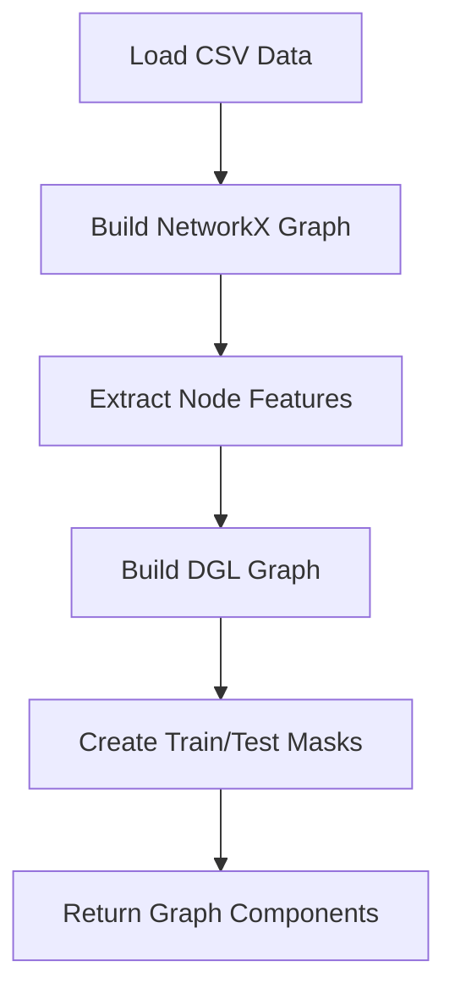

# Bank Data Loader

## Overview
The `bank_data_loader.py` script processes CSV bank transaction data and converts it into DGL (Deep Graph Library) and NetworkX graph representations for use in GNN models.

## Key Components



## Data Processing Steps

### 1. NetworkX Graph Construction
- Creates directed graph using `networkx.DiGraph()`
- Processes sender and receiver account IDs as nodes
- Edges represent transactions between accounts
- Edge weights represent transaction amounts

### 2. Node Feature Extraction
- **Node Features (3 dimensions)**:
  1. Total sent amount per account
  2. Total received amount per account  
  3. Fraud indicator (1 if account involved in fraud transaction, 0 otherwise)

### 3. Node Labeling
- Binary classification labels:
  - 1 for accounts involved in fraud transactions
  - 0 for clean accounts

### 4. DGL Graph Construction
- Converts NetworkX graph to DGL graph format
- Assigns node features and labels to DGL graph
- Creates train/test masks (80/20 split)

## Implementation Details

### Main Function: `load_bank_data(csv_path)`
- **Input**: Path to CSV file containing bank transaction data
- **Output**: Tuple of (NetworkX Graph, DGL Graph, Account ID mapping)

### Key Technical Aspects
- **Account ID Mapping**: Creates bi-directional mapping between account IDs and node indices
- **Feature Aggregation**: Aggregates transaction statistics per account 
- **Fraud Detection**: Identifies fraud accounts by examining all transactions involving those accounts
- **Graph Construction**: Uses DGL's graph constructor with source and destination arrays

### Feature Extraction Process
```python
# Node Feature Vector (3 elements per account):
# [Total Sent Amount, Total Received Amount, Fraud Flag]
```

### Account Processing Flow
1. Identify all unique accounts from sender and receiver columns
2. Create mapping from account ID to node index
3. For each account:
   - Calculate total sent amount
   - Calculate total received amount  
   - Determine if account is fraudulent
4. Build edges from transaction records

## Data Structure

### Input CSV Format
The script expects CSV data with specific column names:
- `Sender Account ID`
- `Receiver Account ID` 
- `Transaction Amount`
- `Fraud Flag`

### Output Graph Components
- **NetworkX Graph**: For analysis and visualization
- **DGL Graph**: For GNN training and inference
- **Node Features**: 3-dimensional feature vectors for each account
- **Node Labels**: Binary fraud classification (0 or 1)
- **Train/Test Masks**: Boolean arrays for splitting data
- **ID Mapping**: Maps node indices back to account IDs

## Usage
```python
from bank_data_loader import load_bank_data
G_nx, dgl_g, id_to_acc = load_bank_data("synthetic_bank_transactions.csv")
```