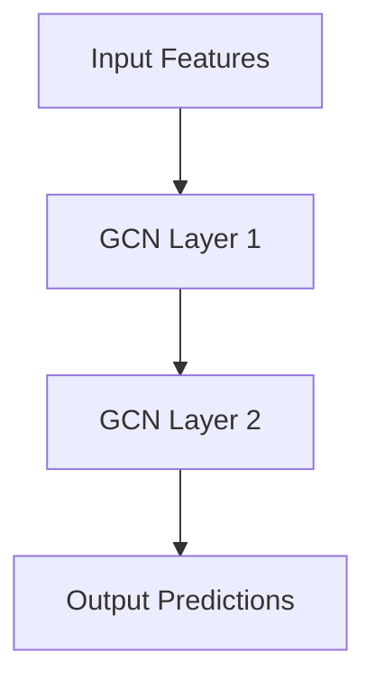

# Bank GNN Model

## Overview
The `bank_gnn_model.py` implements a Graph Convolutional Network (GCN) specifically designed for bank fraud detection. This model serves as the target model in the adversarial attack framework.

## Architecture



## Model Components

### GCN Architecture
The model uses a two-layer GCN structure:
- **Layer 1**: GraphConv with 16 output features and ReLU activation
- **Layer 2**: GraphConv with 2 output features (binary classification: benign vs fraud)

### Core Model Class: `BankGCN`
```python
class BankGCN(nn.Module):
    def __init__(self, in_feats, out_feats):
        super(BankGCN, self).__init__()
        self.conv1 = GraphConv(
            in_feats, 16, activation=F.relu, allow_zero_in_degree=True
        )
        self.conv2 = GraphConv(16, out_feats, allow_zero_in_degree=True)
    
    def forward(self, g, features):
        h = self.conv1(g, features)
        h = self.conv2(g, h)
        return h
```

## Training Process

### Training Function: `train_target_model()`
```python
def train_target_model(g, features, labels, train_mask, test_mask, epochs=100, lr=0.01):
```

### Training Workflow
1. **Model Initialization**: Creates BankGCN with input features and 2 output classes
2. **Optimizer Setup**: Uses Adam optimizer with learning rate 0.01 and weight decay 5e-4
3. **Training Loop**:
   - Sets model to training mode
   - Computes logits via model forward pass
   - Calculates cross-entropy loss on training data
   - Performs backpropagation and optimization step
   - Repeats for specified number of epochs (default 100)

### Evaluation Function: `evaluate_model()`
```python
def evaluate_model(model, g, features, labels, mask):
```

## Key Technical Details

### Graph Convolution Layer Parameters
- **Input Features**: 3-dimensional node features (sent/received amounts, fraud flag)
- **Hidden Layer**: 16 nodes with ReLU activation
- **Output Layer**: 2 nodes (fraud and non-fraud classes)

### Loss Function
- **Binary Cross Entropy**: Uses `F.cross_entropy()` for multi-class classification
- **Training Mask**: Only trains on nodes marked as training data

### Evaluation Metrics
- **Accuracy**: Calculates fraction of correctly classified nodes in test set
- **Test Mask**: Excludes training nodes from evaluation

## Model Purpose
The model serves as the target for adversarial attacks:
- Trained on full dataset to learn fraud patterns
- Provides predictions for attacker queries
- Used to measure attack fidelity (how closely surrogate model follows target predictions)

## Usage
```python
# Train model
model = train_target_model(dgl_g, features, labels, train_mask, test_mask)

# Evaluate model
accuracy = evaluate_model(model, dgl_g, features, labels, test_mask)
```