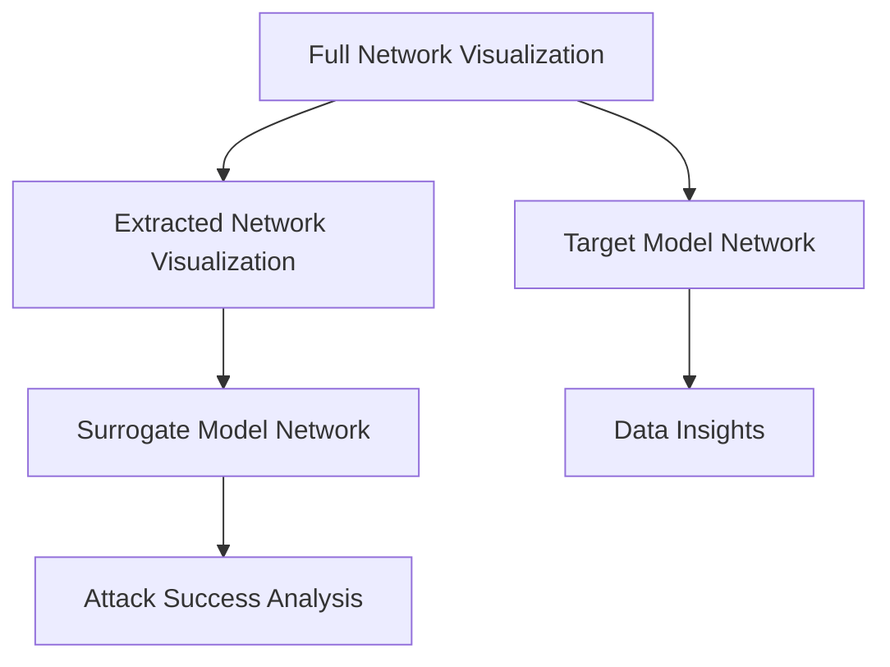

# Bank Visualizer

## Overview
The `bank_visualizer.py` provides visualization capabilities for both target and extracted network structures in the Model Extraction Attacks framework. It offers visual insights into bank fraud detection networks and attack outcomes.

## Key Visualizations



## Core Functions

### 1. `plot_bank_network()`
```python
def plot_bank_network(G_nx, labels, title="Bank Network"):
```

#### Features:
- Visualizes full bank transaction network
- Color codes nodes by fraud status:
  - Red nodes: Fraud accounts (label = 1)
  - Green nodes: Clean accounts (label = 0)
- Edge weights represent transaction amounts
- Clear network structure showing account relationships

### 2. `plot_extracted_network()`
```python
def plot_extracted_network(g, title="Extracted Network"):
```

#### Features:
- Visualizes the adversary's reconstructed network
- Shows graph structure based on adversary knowledge level
- Displays node connections and edge relationships
- Uses consistent node coloring for easy comparison with target network

## Technical Implementation

### NetworkX Graph Visualization
The visualizer uses NetworkX for graph rendering:
- Leverages NetworkX's drawing capabilities
- Handles both directed and weighted graphs
- Supports color coding for different node types

### Visualization Parameters
```python
# Node size and layout
pos = nx.spring_layout(G_nx, k=1, iterations=50)
node_size = 50

# Color mapping
color_map = ['red' if label == 1 else 'green' for label in labels]

# Edge styling
edge_weights = [G_nx[u][v]['weight'] for u, v in G_nx.edges()]
```

## Visualization Process

### Full Network Plotting
1. **Graph Setup**: Load NetworkX graph with precomputed node attributes
2. **Layout Generation**: Compute node positions using spring layout algorithm
3. **Color Assignment**: Map fraud labels to red/green color scheme
4. **Edge Drawing**: Render edges with weights
5. **Title and Legend**: Add descriptive title and color legend

### Extracted Network Plotting
1. **Graph Construction**: Uses adversary's graph representation
2. **Node Positioning**: Applies same layout as target network for comparison
3. **Visual Consistency**: Maintains same color coding and styling
4. **Title Formatting**: Clearly indicates attack type and scenario

## Output Format
The visualizer generates high-resolution PNG images:
- Full bank network visualization
- Extracted network visualization 
- Each image includes clear title and legend
- Consistent styling for easy comparison between networks

## Integration Points

### With Other Components
1. **Data Loading**: Receives NetworkX graph and labels from `bank_data_loader.py`
2. **Attack Framework**: Gets adversary graph from `bank_attacks.py` 
3. **Main Execution**: Used by `main_bank.py` for output display

### Usage Integration
```python
# In main_bank.py
from bank_visualizer import plot_bank_network, plot_extracted_network

# Visualize full network
plot_bank_network(G_nx, labels.numpy(), title="Full Bank Network")

# Visualize extracted network
plot_extracted_network(adv_g, title=f"Extracted Network Attack {args.attack_type}")
```

## Visual Analysis Benefits

### Network Understanding
- **Structural Insights**: Shows how accounts are connected in the financial network
- **Fraud Pattern Recognition**: Visual identification of potential fraud rings
- **Node Centrality**: Identifies key accounts in the network

### Attack Impact Assessment
- **Comparison Analysis**: Direct visualization of target vs extracted networks
- **Knowledge Level Effects**: Shows how different knowledge levels affect reconstruction
- **Attack Success Visualization**: Clear demonstration of model extraction effectiveness

## Visualization Components

### Technical Details
1. **Graph Layout Algorithm**: Spring layout for natural network appearance
2. **Node Size**: All nodes equal size for consistent visual representation
3. **Color Coding**: Standardized red/green for fraud/non-fraud
4. **Edge Weights**: Line thickness and transparency based on transaction amounts
5. **Title Formatting**: Clear, descriptive titles with attack parameters

### Output Quality
- High-resolution PNG graphics (300 DPI)
- Consistent styling across all visualizations
- Automated legend generation and labeling
- Professional presentation suitable for reports and analysis

## Usage Examples
```python
# Full network visualization
plot_bank_network(G_nx, labels, "Full Bank Transaction Network")

# Attack-specific visualization  
plot_extracted_network(adv_g, "Extracted Network - Attack Type 4")
```