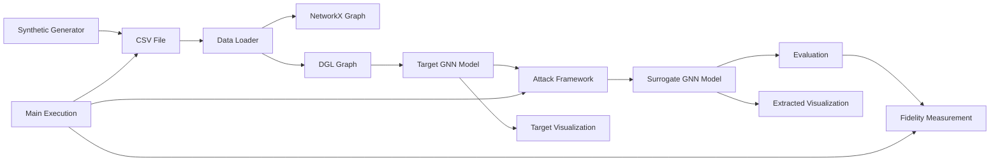
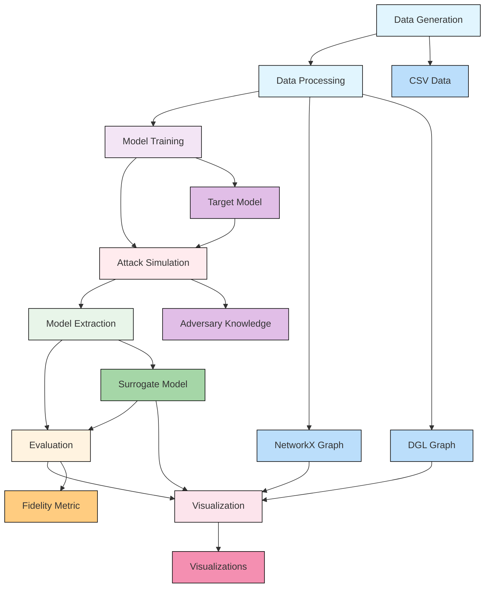
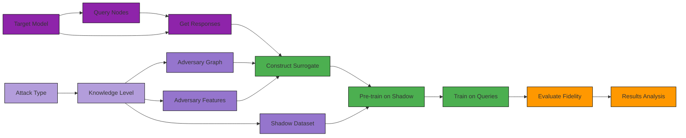
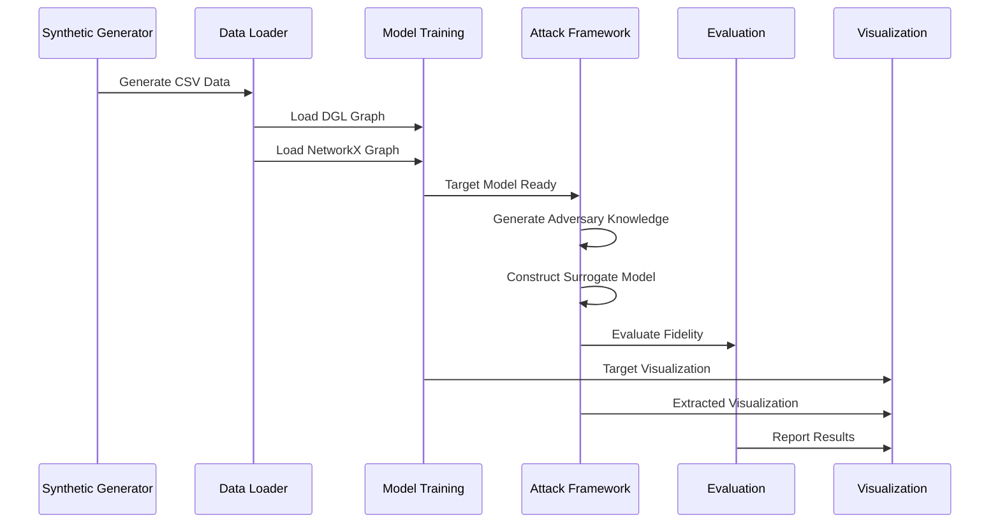

# Knowledge Graph: Model Extraction Attacks on GNNs

## Complete System Overview

This knowledge graph represents the complete Model Extraction Attacks on GNNs framework for bank fraud detection. The system combines data generation, GNN modeling, adversarial attacks, and visualization in a comprehensive security evaluation framework.

```mermaid
graph TD
    %% Data Generation
    A[Synthetic Generator] --> B[Data Loader]
    
    %% Model Components
    B --> C[Target GNN Model]
    C --> D[Attack Framework]
    
    %% Attack Execution
    D --> E[Surrogate Model]
    E --> F[Evaluation]
    
    %% Visualization
    C --> G[Target Visualization]
    E --> H[Extracted Visualization]
    
    %% Integration
    A --> I[Main Execution]
    B --> I
    C --> I
    D --> I
    G --> I
    H --> I
    
    %% Attack Scenarios
    D --> J[Attack Taxonomy]
    
    %% Data Flow
    style A fill:#e1f5fe
    style B fill:#e1f5fe
    style C fill:#f3e5f5
    style D fill:#ffebee
    style E fill:#e8f5e9
    style F fill:#fff3e0
    style G fill:#fce4ec
    style H fill:#fce4ec
    style I fill:#fff8e1
    style J fill:#e0f2f1
    
    class A,B data
    class C,D,E,F,G,H model
    class I, J execution
```

## Detailed Component Relationships

### Data Flow and Dependencies



## System Architecture

### Core Components



## Attack Framework Integration

### Detailed Attack Flow



## Component Interactions

### Data Flow Through System



## Knowledge Graph Summary

### Files Structure
```
notes/
├── project-overview.md
├── synthetic-generator.md
├── bank-data-loader.md
├── bank-gnn-model.md
├── bank-attacks.md
├── main-bank.md
├── bank-visualizer.md
└── attack-taxonomy.md
```

### Key Relationships
1. **Data Foundation**: Synthetic generator → Data loader → Model training
2. **Model Lifecycle**: Model training → Attack framework → Evaluation 
3. **Security Testing**: Attack framework → Surrogate model construction
4. **Results Visualization**: Model training + Attack framework → Visualizations
5. **System Integration**: Main execution coordinates all components

This comprehensive knowledge graph provides a complete understanding of the Model Extraction Attacks on GNNs framework, showing how all components interconnect and contribute to security evaluation of bank fraud detection systems.