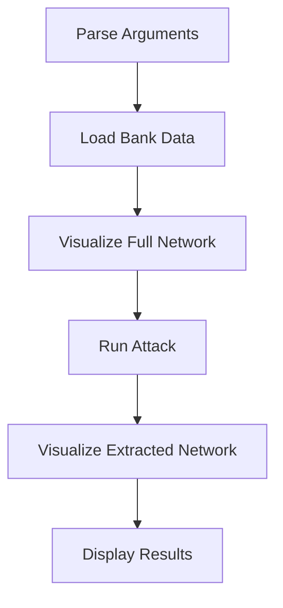

# Main Bank Execution

## Overview
The `main_bank.py` serves as the primary entry point for executing the Model Extraction Attacks on GNNs framework. It orchestrates the complete workflow from data loading to attack execution and visualization.

## System Flow



## Command Line Interface

The main script accepts the following command line arguments:

### Required Arguments:
- `--csv`: Path to CSV data file (default: "synthetic_bank_transactions.csv")

### Attack Configuration:
- `--attack_type`: Attack ID from taxonomy (0-6, default: 0)
- `--attack_node_ratio`: Proportion of nodes for attack (default: 0.25)
- `--sampling_strategy`: "random" or "fraud" (default: "random")

## Main Execution Process

### 1. Argument Parsing
```python
parser = argparse.ArgumentParser()
parser.add_argument("--csv", type=str, default="synthetic_bank_transactions.csv", help="Path to CSV data")
parser.add_argument("--attack_type", type=int, default=0, help="Attack type (0-6)")
parser.add_argument("--attack_node_ratio", type=float, default=0.25, help="Proportion of nodes for attack")
parser.add_argument("--sampling_strategy", type=str, default="random", choices=["random", "fraud"], help="Sampling strategy")
```

### 2. Data Loading
- Uses `load_bank_data()` from `bank_data_loader.py` to process CSV
- Returns NetworkX graph, DGL graph, and account ID mapping
- Prepares data for visualization and attack execution

### 3. Network Visualization
- Calls `plot_bank_network()` from `bank_visualizer.py`
- Creates visualization showing full bank network with fraud indicators:
  - Red nodes: Fraud accounts
  - Green nodes: Clean accounts
  - Edge weights: Transaction amounts

### 4. Attack Execution
- Invokes `run_attack()` from `bank_attacks.py`
- Executes specified attack scenario with adversary knowledge
- Returns surrogate model, adversary graph, features, and fidelity measurement

### 5. Extracted Network Visualization  
- Calls `plot_extracted_network()` from `bank_visualizer.py`
- Shows the adversary's reconstructed network based on their knowledge level

### 6. Results Display
- Prints attack results including:
  - Target model accuracy
  - Attack type and knowledge level
  - Fidelity measurement (how closely surrogate matches target)
  - Attack node ratio and sampling strategy used

## Key Components Used

### 1. Data Processing
```python
G_nx, dgl_g, id_to_acc = load_bank_data(args.csv)
features = dgl_g.ndata["feat"]
labels = dgl_g.ndata["label"]
```

### 2. Visualization
```python
plot_bank_network(G_nx, labels.numpy(), title="Full Bank Network")
plot_extracted_network(adv_g, title=f"Extracted Network Attack {args.attack_type}")
```

### 3. Attack Execution
```python
surrogate_model, adv_g, adv_feat, fidelity = run_attack(
    args.attack_type, args.csv, args.attack_node_ratio, args.sampling_strategy
)
```

## Usage Examples

### Basic Usage
```bash
python main_bank.py --csv bank_transaction_data_large.csv --attack_type 4 --attack_node_ratio 0.05
```

### Fraud-Focused Attack
```bash
python main_bank.py --csv bank_transaction_data_large.csv --attack_type 4 --sampling_strategy fraud
```

### Different Attack Scenario
```bash
python main_bank.py --csv bank_transaction_data_large.csv --attack_type 0 --attack_node_ratio 0.1
```

## Output
The script produces:
1. Full network visualization (PNG image)
2. Extracted network visualization (PNG image) 
3. Attack results including:
   - Target model accuracy
   - Attack type and configuration
   - Fidelity metric (measuring attack success)
4. Console output with detailed execution information

## Architecture Integration

The main script demonstrates complete integration of all components:
```
main_bank.py
├── Argument parsing
├── Data loading (bank_data_loader.py)
├── Target model training and evaluation
├── Attack execution (bank_attacks.py)
├── Visualization (bank_visualizer.py)
└── Results display
```

This end-to-end execution provides a complete framework for studying adversarial attacks against GNN fraud detection models, from data preparation through attack evaluation and visualization of results.