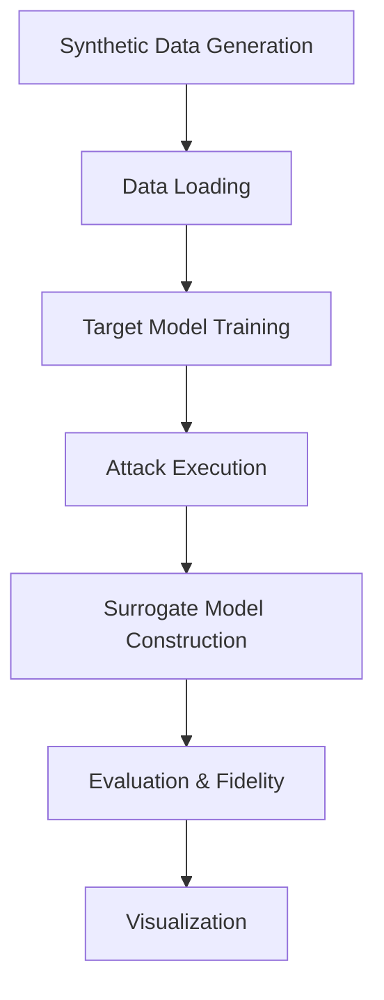

# Project Overview: Model Extraction Attacks on GNNs for Bank Fraud Detection

## Summary
This project implements an adversarial study on the vulnerability of Graph Neural Networks (GNNs) used for bank fraud detection. It demonstrates how an adversary can build a surrogate model that mimics the behavior of a target GNN through various levels of knowledge about graph structure and node attributes.

## Core Components

### Attack Taxonomy
The framework implements 7 distinct attack scenarios organized by adversary knowledge level:

| Attack ID | Attributes | Structure | Shadow Dataset | Knowledge Level |
| :---: | :---: | :---: | :---: | :---: |
| **0** | Partial | Partial | Unknown | Low/Medium |
| **1** | Partial | Unknown | Unknown | Low |
| **2** | Unknown | Known | Unknown | Medium |
| **3** | Unknown | Unknown | Known | Medium |
| **4** | Partial | Partial | Known | High |
| **5** | Partial | Unknown | Known | Medium |
| **6** | Unknown | Known | Known | High |

### Key Features
- Multiple attack types to simulate varying adversary capabilities
- Detailed evaluation through fidelity metric
- Visualization of both target and extracted networks
- Comprehensive documentation of attack scenarios

This knowledge graph represents the complete framework for studying adversarial attacks on GNNs in financial fraud detection contexts.