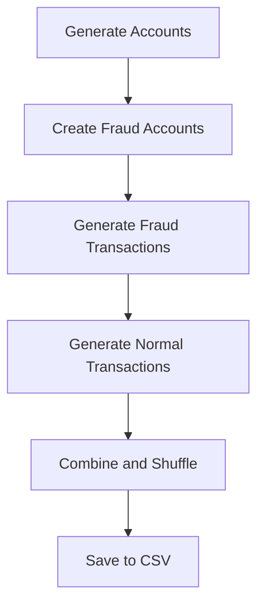

# Synthetic Data Generator

## Overview
The `synthetic_generator.py` script creates large-scale synthetic bank transaction data with fraud clusters to demonstrate the effectiveness of GNN-based attacks. The generated datasets include realistic transaction patterns and fraud rings.

## Key Components



### Data Structure
The generator creates transaction data with the following fields:
- Transaction ID
- Sender Account ID
- Receiver Account ID
- Transaction Amount
- Transaction Type (Deposit, Withdrawal, Transfer)
- Timestamp
- Transaction Status (Success, Failed)
- Fraud Flag (Boolean)
- Geolocation (Latitude/Longitude)
- Device Used (Desktop, Mobile)
- Network Slice ID
- Latency (ms)
- Slice Bandwidth (Mbps)
- PIN Code

## Implementation Details

### Core Function: `generate_synthetic_bank_data()`
- **Parameters**:
  - `num_records=1000000`: Total number of transactions to generate
  - `fraud_rate=0.01`: Percentage of transactions flagged as fraud (1% by default)
  - `output_file="bank_transaction_data_large.csv"`: Output filename

### Fraud Cluster Implementation
The script creates fraud rings where:
- Fraud accounts transact with each other (to simulate fraud cluster behavior)
- Fraud accounts are randomly selected from the total account pool
- Each fraud transaction has higher amounts than normal transactions

### Data Generation Process
1. **Account Creation**:
   - Creates 10% of total records as unique accounts
   - Assigns unique identifiers to all accounts

2. **Fraud Transaction Generation**:
   - Generates fraud transactions with random fraud account pairs
   - Uses higher transaction amounts (500-5000) for fraud cases

3. **Normal Transaction Generation**:
   - Generates remaining transactions with normal distribution
   - Uses exponential distribution for transaction amounts (mean ~200)

4. **Data Validation**:
   - Ensures actual fraud rate matches specified rate
   - Applies random shuffling of all records

### Key Technical Details
- Uses `pandas` for efficient data handling
- Leverages `numpy` and `random` for statistical distributions
- Implements `datetime` and `timedelta` for realistic timestamps
- Creates clustered fraud patterns to make GNN attacks more realistic

## Usage
```bash
python synthetic_generator.py
```

This creates `bank_transaction_data_large.csv` with 1 million records and 1% fraud rate.