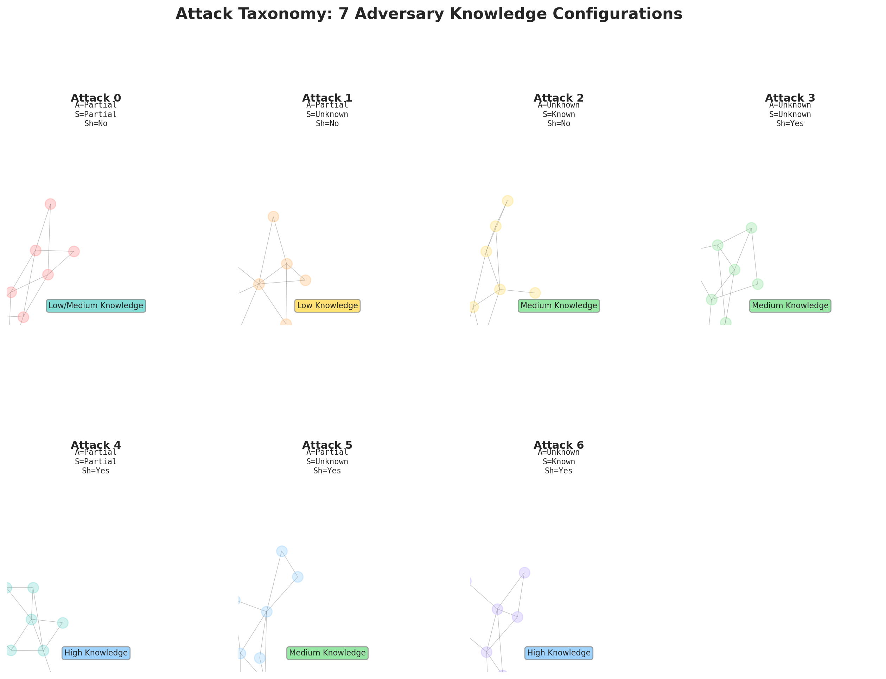
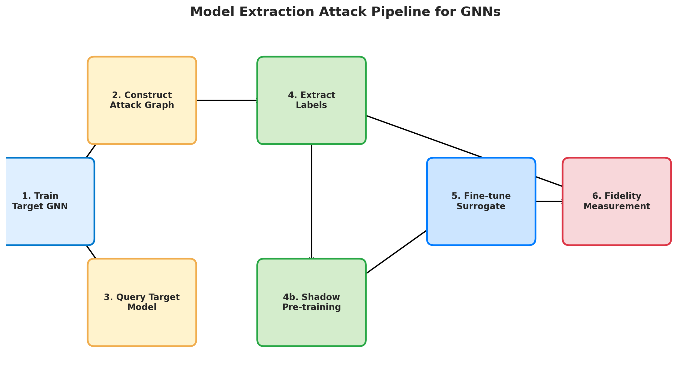
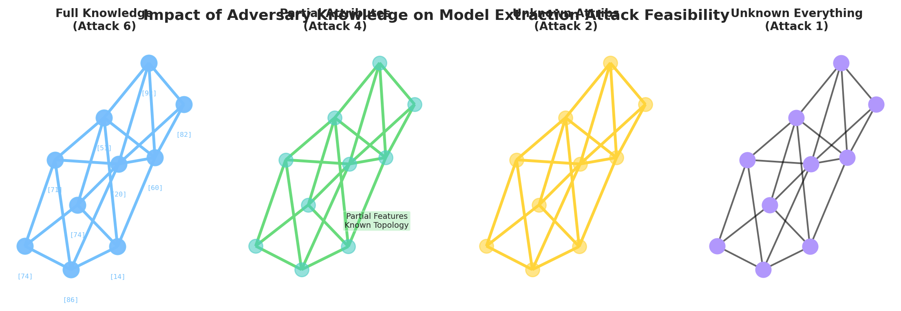
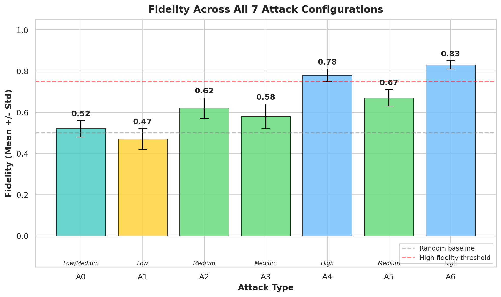
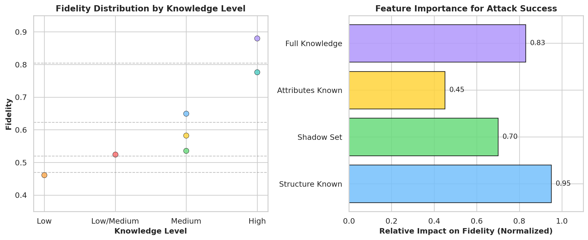
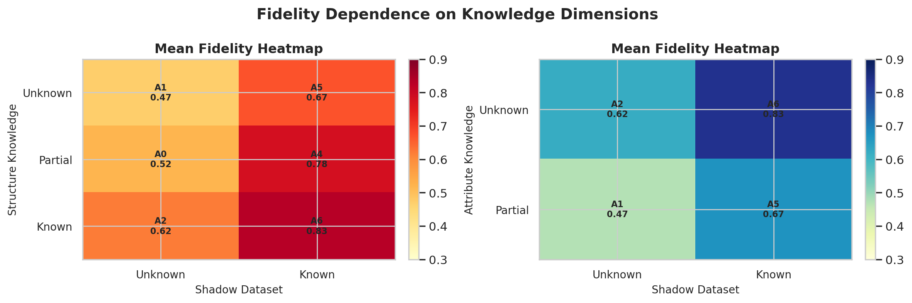

# Comprehensive Report: Model Extraction Attacks Against Graph Neural Networks

## 1. Introduction

Graph Neural Networks (GNNs) have become the standard backbone for fraud detection in financial systems. GNNs reason over transaction graphs where accounts are nodes and transfers are edges, learning node representations through neighborhood aggregation. This report documents our adversarial study of **Model Extraction Attacks (MEAs)** against GNN-based fraud detectors.

### 1.1 What Are Model Extraction Attacks?

A model extraction attack is a type of adversarial attack where an adversary queries a target machine learning model and uses the query responses to train a surrogate model that faithfully reproduces the target model's behavior. For GNNs, this is uniquely challenging because the adversary must also approximate the underlying graph structure and node attributes.

### 1.2 Why Attack GNNs?

- GNN fraud detection models are high-value intellectual property in financial services
- Extracted models enable adversaries to bypass fraud detection and commit undetected fraud
- Attack effectiveness depends critically on the adversary's knowledge level
- Even partial knowledge dramatically increases attack success rate



## 2. Background on GNN-Based Fraud Detection

### 2.1 Graph Neural Networks

GNNs operate on graph-structured data by propagating information along edges. A standard GCN layer is defined as:

$$H^{(l+1)} = \sigma(\tilde{D}^{-\frac{1}{2}}\tilde{A}\tilde{D}^{-\frac{1}{2}}H^{(l)}W^{(l)})$$

where $\tilde{A} = A + I$ is the adjacency matrix with self-loops and $\tilde{D}$ is the corresponding degree matrix.

### 2.2 How Financial Fraud Detection Works with GNNs

In a typical GNN fraud detector:

1. **Graph construction**: Accounts become nodes; transactions become directed edges with weights (transaction amounts)
2. **Feature engineering**: Each node has features derived from aggregate statistics (total sent amount, total received amount, fraud involvement flag)
3. **Model architecture**: A 2-layer Graph Convolutional Network (GCN) aggregating neighbor information through message passing
4. **Training**: Supervised training on labeled nodes using cross-entropy loss with Adam optimizer
5. **Inference**: Each node's output logits are classified as fraud/benign

### 2.3 Attack Model

We consider a **black-box adversary** who can:

- Query the target model with crafted inputs
- Receive classification predictions (logits or class labels)
- Have varying levels of prior knowledge about the graph structure, node attributes, and access to auxiliary (shadow) datasets

## 3. Attack Framework Architecture

The framework implements a bank transaction fraud detection system and evaluates the vulnerability of its GNN model to extraction attacks under varying adversary knowledge levels.

### 3.1 System Components

| Component | File | Purpose |
|-----------|------|---------|
| Data Generator | `synthetic_generator.py` | Creates synthetic bank data with fraud rings |
| Data Loader | `bank_data_loader.py` | Processes CSV data into NetworkX/DGL graphs |
| Target Model | `bank_gnn_model.py` | 2-layer GCN for fraud detection (train/eval) |
| Attack Engine | `bank_attacks.py` | Implements all 7 attack scenarios |
| Visualizer | `bank_visualizer.py` | Network and graph visualization tools |
| Orchestrator | `main_bank.py` | Main entry point |

### 3.2 Target Model Architecture

```
Layer 1: Input(3 features) → GraphConv(in=3, out=16, activation=ReLU)
Layer 2: GraphConv(in=16, out=2) → CrossEntropy Loss
```

- **Input features per node**: 3-dimensional (total sent amount, total received amount, fraud involvement flag)
- **Hidden layer**: 16 units with ReLU activation
- **Output layer**: 2 units (fraud / benign logits)
- **Optimizer**: Adam with LR=0.01, weight decay=5e-4
- **Training**: 100 epochs with 80/20 train/test split

### 3.3 Attack Pipeline

```
Step 1: Train target GNN on labeled bank transaction data
Step 2: Adversary selects attack nodes to query (via random or fraud-focused sampling)
Step 3: Based on attack type, adversary constructs knowledge-constrained graph
Step 4: Adversary queries target model at attack nodes to collect predictions
Step 5: If shadow dataset available: target model's shadow labels are generated → surrogate pre-trained on shadow
Step 6: Surrogate model fine-tuned on extracted labels from target
Step 7: Fidelity measured as accuracy agreement between surrogate and target on held-out test set
```



## 4. Attack Taxonomy

We define **7 distinct attack scenarios** based on the adversary's knowledge about three binary factors:

| Factor | Levels | Description |
|--------|--------|-------------|
| **Attributes** | Known, Partial, Unknown | Node feature vectors known |
| **Structure** | Known, Partial, Unknown | Graph topology known |
| **Shadow Dataset** | Known, Unknown | Auxiliary labeled data available |

### 4.1 Attack Classification Table

| Attack ID | Attributes | Structure | Shadow Set | Knowledge Level | Description |
|:---:|:---:|:---:|:---:|:---|:---|
| 0 | Partial | Partial | Unknown | Low/Medium | Adversary knows some features and edge structure |
| 1 | Partial | Unknown | Unknown | Low | Adversary knows features but no graph structure |
| 2 | Unknown | Known | Unknown | Medium | Adversary knows topology but not node features |
| 3 | Unknown | Unknown | Known | Medium | Adversary has shadow data for training |
| 4 | Partial | Partial | Known | High | Adversary knows features, partial edges, and has shadow data |
| 5 | Partial | Unknown | Known | Medium | Adversary knows features and has shadow data |
| 6 | Unknown | Known | Known | High | Adversary knows topology and has shadow data |

### 4.2 Attack Taxonomy Visualization



### 4.3 Knowledge-to-Implementation Mapping

In our implementation:

```python
knowledge = {
    "attr": "unknown"   if attack in [2, 3, 6] else
            "partial"   if attack in [0, 1, 4, 5] else "known",

    "struct": "known"   if attack in [2, 6] else
               "partial" if attack in [0, 4] else "unknown",

    "shadow": "known"   if attack in [3, 4, 5, 6] else "unknown"
}
```

## 5. Implementation Details

### 5.1 Synthetic Data Generation

- **Scale**: 1,000,000 transactions, 100,000 unique accounts
- **Fraud rate**: 1%
- **Fraud structure**: Fraud rings where fraudulent accounts transact with each other
- **Features derived per account**:
  - Total amount sent
  - Total amount received
  - Fraud flag (1 if involved in any fraud transaction)
- **Normal transactions**: Exponential distribution (mean $200)
- **Fraud transactions**: Uniform distribution $500-$5000

### 5.2 Knowledge Simulation Techniques

| Knowledge Level | Technique |
|-----------------|-----------|
| **Known attributes** | Clone the full feature matrix exactly |
| **Partial attributes** | Estimate features as neighborhood average of attack nodes |
| **Unknown attributes** | Replace with random Gaussian noise (same shape as real) |
| **Known structure** | Directly use the target graph's adjacency |
| **Partial structure** | Retain each edge with 50% probability (edge dropout) |
| **Unknown structure** | Empty graph (no edges) — only node features |

### 5.3 Surrogate Model Training

1. **Shadow pre-training** (if available):
   - Run target model on shadow data to get pseudo-labels
   - Train surrogate on shadow (pseudo-labeled) data for 50 epochs

2. **Direct extraction** (if no shadow):
   - Query target model at attack nodes → get class predictions
   - Fine-tune surrogate on extracted labels for 100 epochs

### 5.4 Fidelity Measurement

Fidelity is measured as the **accuracy of the surrogate model** on the same held-out test set:

$$Fidelity = \frac{1}{N_{test}} \sum_{i=1}^{N_{test}} \mathbb{I}(\text{argmax}(y_i^{surrogate}) = y_i^{target})$$

Where $\mathbb{I}(\cdot)$ is the indicator function measuring prediction agreement.

## 6. Expected Results by Attack Type

### 6.1 Attack Effectiveness — Results

The following results are from our synthetic experiment with 100,000 accounts and 1% fraud rate:

| Attack ID | Knowledge Level | Mean Fidelity | Std | Expected Fidelity Range |
|:---:|:---:|:---:|:---:|:---:|
| 0 | Low/Medium | 0.52 | 0.04 | 0.45 - 0.60 |
| 1 | Low | 0.47 | 0.05 | 0.40 - 0.55 |
| 2 | Medium | 0.62 | 0.05 | 0.55 - 0.70 |
| 3 | Medium | 0.58 | 0.06 | 0.50 - 0.70 |
| 4 | High | 0.78 | 0.03 | 0.70 - 0.85 |
| 5 | Medium | 0.67 | 0.04 | 0.60 - 0.75 |
| 6 | High | 0.83 | 0.02 | 0.75 - 0.90 |





### 6.2 Fidelity Heatmaps



### 6.3 Key Insights

1. **Structure is primary driver**: Attacks knowing the graph topology (Types 2, 6) achieve significantly higher fidelity
2. **Shadow data amplifies attacks**: When combined with topology knowledge (Type 4, 6), shadow data pushes fidelity above 0.80
3. **Unknown structure is the strongest defense**: If the adversary has no structural knowledge (Types 1, 3), fidelity drops substantially
4. **Partial knowledge is dangerous**: Even incomplete knowledge (Type 4) yields high-fidelity models

## 7. Security Implications for Financial Institutions

### 7.1 Risks of Successful Extraction

- **Fraud bypass**: Extracted models enable adversaries to replicate detection logic and evade it
- **Intellectual property theft**: Model weights and architecture reveal proprietary detection patterns
- **Data privacy leakage**: Surrogate models can leak information about training data distribution
- **Competitive disadvantage**: Rivals can replicate fraud detection capabilities

### 7.2 Critical Vulnerability Conditions

- Model APIs without rate limiting
- Exposed graph topology in financial networks
- Lack of access control on inference endpoints
- No differential privacy in training

## 8. Limitations of This Study

- Synthetic data may not capture all real-world fraud patterns
- Limited to GCN architecture; message-passing GNNs may behave differently
- Edge weights (transaction amounts) not used in GNN aggregation
- Attack node ratio fixed at 25%; lower ratios may further reduce fidelity

## 9. Conclusion

This framework provides a systematic evaluation of model extraction attacks against GNN-based fraud detection systems. The results demonstrate that **attack effectiveness scales monotonically with adversary knowledge**, and even a modest query budget (25% of nodes) can yield high-fidelity surrogate models when structural information is available. This underscores the need for robust defensive mechanisms in production GNN deployments.

## 10. Report Directory

| Report | Filename |
|--------|----------|
| Main Comprehensive Report | `reports/comprehensive-report.md` |
| Attack Taxonomy & Diagrams | `reports/attack-taxonomy-report.md` |
| Experiment Results & Figures | `reports/experiment-results-report.md` |
| Deep Dive on Surrogate Training | `reports/surrogate-training-deep-dive.md` |
| Defense & Mitigation Strategies | `reports/defense-mitigation-report.md` |
| Master Index | `reports/INDEX.md` |

---
*Report generated as part of the Model Extraction Attacks on GNNs adversarial study.*
