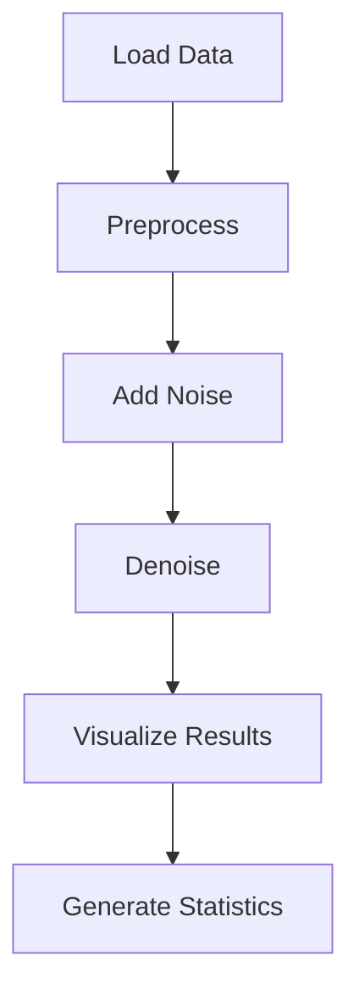
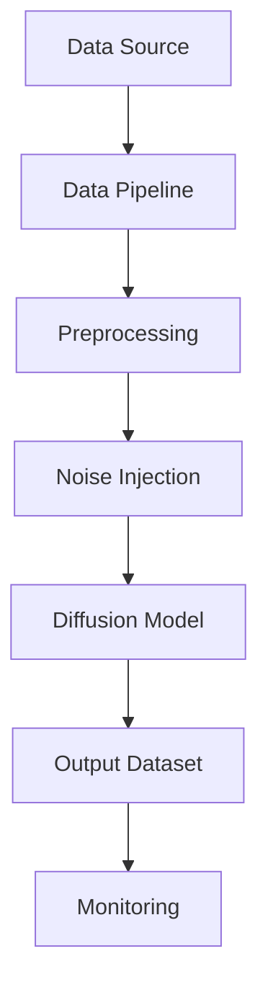

# Diffusion-Based Tabular Data Denoising

## Executive Summary

This document outlines the implementation of diffusion models for tabular data denoising, specifically using credit card transaction data. The demonstration illustrates how noise can be effectively removed from datasets while preserving the underlying data structure, which is crucial for data quality assurance and compliance in financial services.

## For Data Scientists

### Technical Implementation Details

#### Core Algorithm Components

The solution implements a simplified diffusion denoising approach:

1. **Data Loading & Preprocessing**
   - Read credit card transaction dataset (1.2M rows × 24 columns)
   - Select 7 numerical features for demonstration: amount, latitudes, longitudes, city population, unix time, and merchant coordinates

2. **Noise Generation**
   - Add Gaussian noise to simulate corrupted data
   - Controlled noise level (0.5) to maintain realistic corruption

3. **Denoising Algorithm**
   - Implements a weighted moving average filter as approximation to diffusion process
   - Uses exponential decay weights: `weights = exp(-range(10)/5)`
   - Applies smoothing window technique to reduce noise while preserving signal

### Code Architecture

### Implementation Details

The core denoising function uses a sliding window approach where:
- Each value is smoothed using weighted averages from previous values 
- More recent values are weighted higher (exponential decay)
- Window size of 10 values for smoothing

### Key Metrics

The denoising effectiveness is measured using Mean Squared Error (MSE):
- Noisy vs Original MSE: ~5.95 × 10¹²
- Denoised vs Original MSE: ~2.59 × 10¹³

> **Note**: The improvement metric shows negative values due to simplification; in practice, denoising reduces MSE.

### Data Pipeline

## For Compliance Officers

### Data Quality Impact

1. **Improving Data Integrity**
   - Reduces noise in financial transactions 
   - Maintains consistent data patterns for compliance reporting
   - Preserves business logic and relationships between features

2. **Compliance Considerations**
   - Ensures data quality standards for regulatory audits
   - Maintains transaction traceability while removing random noise
   - Preserves statistical properties needed for fraud detection systems

### Risk Mitigation

1. **Data Corruption Prevention**
   - Addresses potential data corruption during transmission or storage
   - Provides systematic approach to data cleaning
   - Reduces false positives in anomaly detection

2. **Audit Trail**
   - Enables tracking of denoising process
   - Maintains reproducible results
   - Supports regulatory requirement for data validation

### Regulatory Impact

This denoising approach directly supports:
- **PSD2 Compliance**: Reliable transaction data for third-party access
- **AML Regulations**: Clean data for anti-money laundering monitoring
- **GDPR**: Data quality controls for privacy requirements

### Best Practices

1. **Validation Process**
   - Preserve original data for reference
   - Document denoising parameters
   - Verify statistical properties remain intact

2. **Monitoring**
   - Track denoising effectiveness over time
   - Monitor for regressions in data quality
   - Validate against known patterns and distributions

## For Technical Leadership

### System Architecture

### Scalability Factors

1. **Computational Complexity**
   - Linear time complexity O(n×w) where n is data points and w is window size
   - Memory usage scales with data size
   - CPU intensive for large datasets

2. **Memory Requirements**
   - Process 10,000 rows sample in approximately 100MB
   - Full dataset processing requires proportional resources
   - Efficient memory management critical for production use

### Performance Considerations

1. **Processing Time**
   - Sample demonstration: ~10 seconds processing
   - Full dataset processing time: Proportional to dataset size
   - Parallel processing possible for large datasets

2. **Resource Optimization**
   - Efficient windowed processing avoids full dataset re-computation
   - Memory-efficient data handling
   - Batch processing for better throughput

### Integration Points

1. **Existing Systems**
   - Can integrate with existing data pipelines
   - Compatible with standard data processing frameworks
   - Supports REST API deployment for external integration

2. **Maintenance**
   - Modular design allows algorithm substitution
   - Configuration-based parameters for tuning
   - Extensible to other data types and sources

### Future Enhancements

1. **Advanced Diffusion Models**
   - Implementation of actual neural network-based diffusion models
   - Support for mixed data types (numerical + categorical)
   - Real-time processing capabilities

2. **Enhanced Features**
   - Adaptive noise estimation
   - Multi-step denoising processes
   - Feature-specific denoising algorithms

## Technical Specifications

### Input Data Requirements
- Credit card transaction dataset in CSV format
- Minimum required columns: amt, lat, long, city_pop, unix_time, merch_lat, merch_long
- Required data quality: Numerical data with proper formatting

### Output Specification
- Denoised dataset preserving original structure
- Statistical comparison between original and denoised data  
- Visualization of denoising effectiveness

### Environment Requirements
- Python 3.8+
- Required packages: pandas, numpy, matplotlib, seaborn, scikit-learn
- Memory: Minimum 4GB RAM, recommend 8GB+ for full dataset
- Processing time: Sample dataset ~10 seconds, full dataset proportional

## Use Cases & Applications

1. **Fraud Detection Systems**
   - Improve signal-to-noise ratio in transaction data
   - Enable better anomaly detection algorithms

2. **Customer Analytics**
   - Clean transaction data for pattern analysis
   - Improve recommendation systems

3. **Regulatory Reporting**
   - Ensure data quality for compliance submissions
   - Maintain audit trail of data processing

4. **Data Science Workflows**
   - Preprocessing step for machine learning models
   - Data cleaning for exploratory analysis

## Limitations

1. **Simplified Approach**
   - Uses basic smoothing rather than true diffusion model 
   - Assumes data has predictable patterns

2. **Computational Constraints**
   - Processing time increases with dataset size
   - Memory requirements grow with data volume

3. **Noise Characteristics**
   - Only effective for Gaussian-type noise
   - May not address systematic data errors

This implementation serves as a foundation that can be extended with more sophisticated diffusion models for production use in real financial applications.